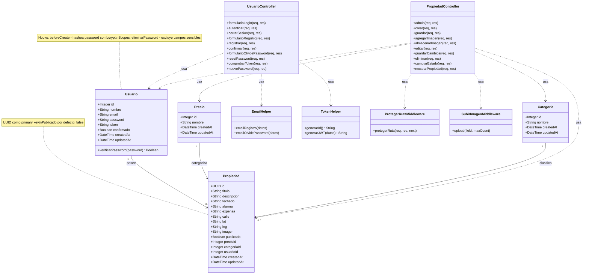

# Diagrama de Clases - Casual Parking

## Diagrama en Mermaid

## Descripción de Relaciones

### Relaciones de Modelos:
- **Usuario → Propiedad (1:N)**: Un usuario puede tener múltiples propiedades
- **Precio → Propiedad (1:N)**: Un precio puede estar asociado a múltiples propiedades
- **Categoría → Propiedad (1:N)**: Una categoría puede tener múltiples propiedades

### Componentes del Sistema:

#### Modelos (Sequelize ORM):
1. **Usuario**: Gestión de usuarios con autenticación bcrypt
2. **Propiedad**: Propiedades inmobiliarias con geolocalización
3. **Categoría**: Clasificación de propiedades (casa, departamento, etc.)
4. **Precio**: Rangos de precios para filtrado

#### Controladores:
1. **UsuarioController**: Maneja autenticación, registro y recuperación de contraseña
2. **PropiedadController**: CRUD de propiedades, gestión de imágenes y publicación

#### Helpers:
1. **EmailHelper**: Envío de correos de registro y recuperación
2. **TokenHelper**: Generación de tokens JWT y IDs únicos

#### Middleware:
1. **ProtegerRutaMiddleware**: Verifica autenticación JWT
2. **SubirImagenMiddleware**: Gestión de carga de imágenes con Multer

## Características Especiales:

- **Seguridad**:
  - Contraseñas hasheadas con bcrypt
  - Protección CSRF  (Cross-Site Request Forgery, o Falsificación de Petición entre Sitios) por token entre el server y foormularios o pages
  - Autenticación JWT

- **Validación**: Express-validator en controladores

- **Almacenamiento**: Imágenes con Multer, carpeta public/

- **Base de datos**: MySQL con Sequelize ORM
