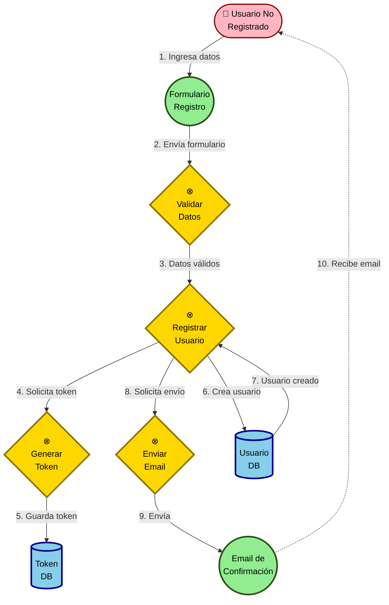
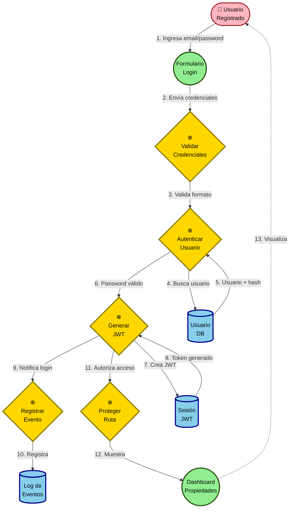
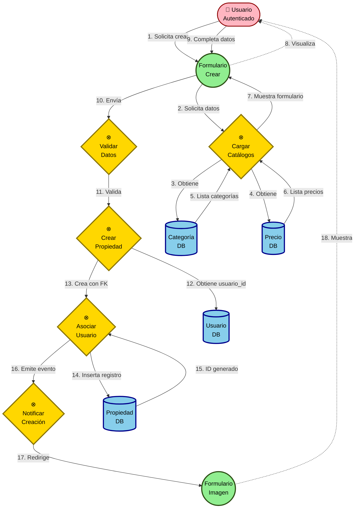
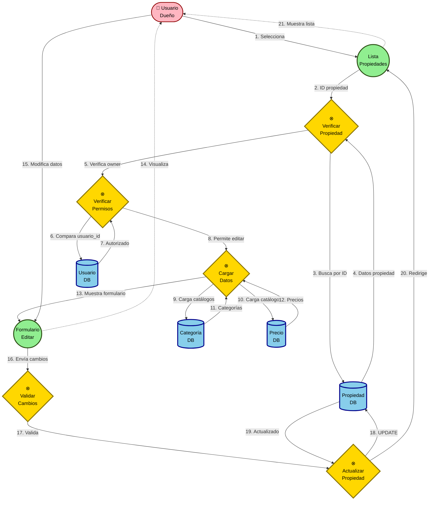
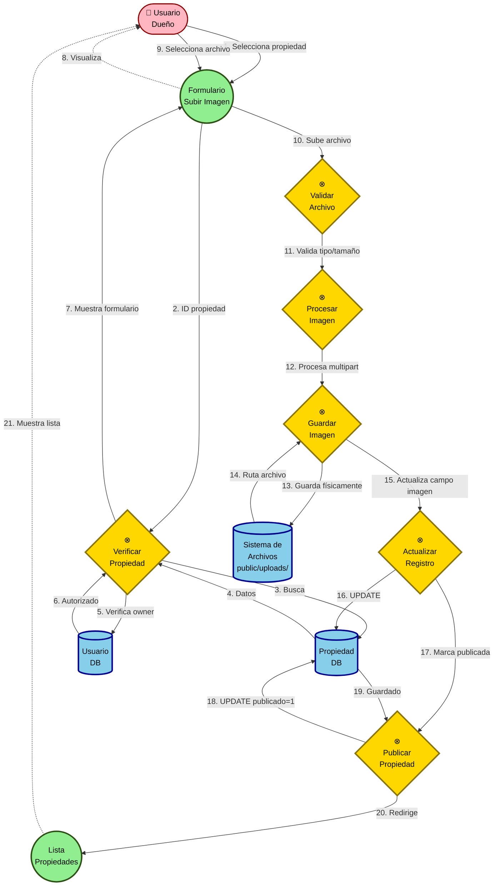
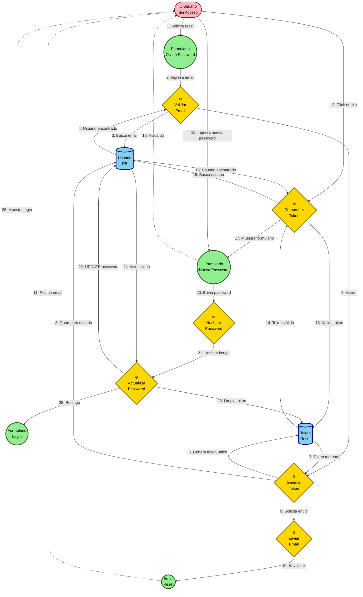
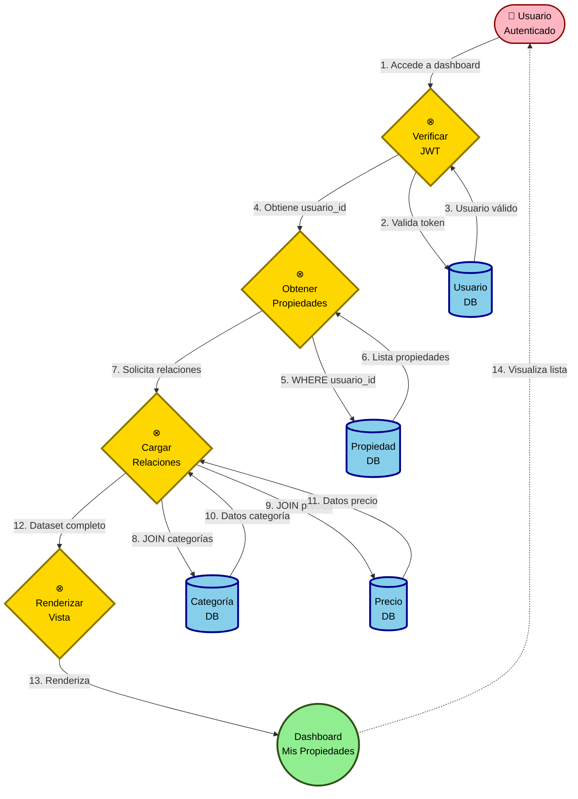

# Diagramas de Robustez UML - Sistema de Gestión de Propiedades Inmobiliarias

## Introducción

Los diagramas de robustez son parte de la metodología ICONIX y sirven como puente entre los casos de uso y los diagramas de secuencia. Utilizan **tres estereotipos principales** según la notación UML estándar:

### Notación UML Estándar:

```
┌─────────────────┬──────────────────────────┬─────────────────────────────────────────┐
│   ESTEREOTIPO   │      REPRESENTACIÓN      │              DESCRIPCIÓN                │
├─────────────────┼──────────────────────────┼─────────────────────────────────────────┤
│   BOUNDARY      │      ○ Círculo verde     │ Interfaces de usuario (formularios,    │
│   (Límite)      │      (límite/frontera)   │ pantallas, emails, APIs). Punto de      │
│                 │                          │ contacto entre actor y sistema.         │
├─────────────────┼──────────────────────────┼─────────────────────────────────────────┤
│   CONTROL       │   ⊗ Círculo amarillo     │ Lógica de negocio, coordinación entre   │
│   (Control)     │   (con flecha/símbolo)   │ boundaries y entities. **Nombrados en   │
│                 │                          │ VERBO INFINITIVO** (Validar, Registrar, │
│                 │                          │ Autenticar, Crear, Eliminar).           │
├─────────────────┼──────────────────────────┼─────────────────────────────────────────┤
│   ENTITY        │  ▭ Círculo/Rectángulo    │ Objetos del dominio, modelos de datos,  │
│   (Entidad)     │  azul (con línea abajo)  │ bases de datos, archivos, repositorios. │
└─────────────────┴──────────────────────────┴─────────────────────────────────────────┘
```

### Reglas de Interacción UML:
1. Los **Actores** solo interactúan con **Boundaries**
2. Los **Boundaries** se comunican con **Controls** (nunca directamente con Entities)
3. Los **Controls** orquestan la lógica y acceden a **Entities**
4. Las **Entities** solo responden a **Controls** (nunca a Boundaries ni Actores)

---

## 1. Caso de Uso: Registrar Usuario

**Actor**: Usuario no registrado
**Descripción**: El usuario completa el formulario de registro y recibe un email de confirmación.



### Elementos Identificados:

| Tipo | Elemento | Implementación | Descripción |
|------|----------|----------------|-------------|
| **Actor** | Usuario No Registrado | - | Persona que desea crear cuenta |
| **Boundary** | Formulario Registro | `views/auth/registro.pug` | Interfaz de entrada de datos |
| **Boundary** | Email Confirmación | Template email SMTP | Interfaz de salida al usuario |
| **Control** | Validar Datos | `express-validator` en routes | Verbo: **Validar** |
| **Control** | Registrar Usuario | `UsuarioController.registrar()` | Verbo: **Registrar** |
| **Control** | Generar Token | `TokenHelper.generarId()` | Verbo: **Generar** |
| **Control** | Enviar Email | `EmailHelper.emailRegistro()` | Verbo: **Enviar** |
| **Entity** | Usuario DB | `models/Usuario.js` | Base de datos de usuarios |
| **Entity** | Token DB | Campo `token` en Usuario | Almacenamiento de token |

---

## 2. Caso de Uso: Iniciar Sesión

**Actor**: Usuario registrado
**Descripción**: El usuario ingresa sus credenciales y accede al sistema.



### Elementos Identificados:

| Tipo | Elemento | Implementación | Descripción |
|------|----------|----------------|-------------|
| **Actor** | Usuario Registrado | - | Usuario con cuenta activa |
| **Boundary** | Formulario Login | `views/auth/login.pug` | Pantalla de autenticación |
| **Boundary** | Dashboard Propiedades | `views/propiedades/admin.pug` | Pantalla principal del usuario |
| **Control** | Validar Credenciales | `express-validator` | Verbo: **Validar** |
| **Control** | Autenticar Usuario | `UsuarioController.autenticar()` | Verbo: **Autenticar** |
| **Control** | Generar JWT | `TokenHelper.generarJWT()` | Verbo: **Generar** |
| **Control** | Proteger Ruta | `middleware/protegerRuta.js` | Verbo: **Proteger** |
| **Control** | Registrar Evento | `EventEmitter.emit('userLoggedIn')` | Verbo: **Registrar** |
| **Entity** | Usuario DB | `models/Usuario.js` | Base de datos |
| **Entity** | Sesión JWT | Cookie/LocalStorage | Token de sesión |
| **Entity** | Log de Eventos | `helpers/eventEmitter.js` | Registro de auditoría |

---

## 3. Caso de Uso: Crear Propiedad

**Actor**: Usuario autenticado
**Descripción**: El usuario crea una nueva propiedad ingresando título, descripción, ubicación, etc.



### Elementos Identificados:

| Tipo | Elemento | Implementación | Descripción |
|------|----------|----------------|-------------|
| **Actor** | Usuario Autenticado | - | Usuario logueado con JWT |
| **Boundary** | Formulario Crear | `views/propiedades/crear.pug` | Interfaz de creación |
| **Boundary** | Formulario Imagen | `views/propiedades/agregar-imagen.pug` | Pantalla de carga de imagen |
| **Control** | Cargar Catálogos | `PropiedadController.crear()` | Verbo: **Cargar** |
| **Control** | Validar Datos | `express-validator` | Verbo: **Validar** |
| **Control** | Crear Propiedad | `PropiedadController.guardar()` | Verbo: **Crear** |
| **Control** | Asociar Usuario | Lógica en `guardar()` | Verbo: **Asociar** |
| **Control** | Notificar Creación | `EventEmitter.emit('propertyCreated')` | Verbo: **Notificar** |
| **Entity** | Categoría DB | `models/Categoria.js` | Catálogo |
| **Entity** | Precio DB | `models/Precio.js` | Catálogo |
| **Entity** | Propiedad DB | `models/Propiedad.js` | Tabla principal |
| **Entity** | Usuario DB | `models/Usuario.js` | FK usuario_id |

---

## 4. Caso de Uso: Editar Propiedad

**Actor**: Usuario autenticado (dueño de la propiedad)
**Descripción**: El usuario modifica los datos de una propiedad existente.



### Elementos Identificados:

| Tipo | Elemento | Implementación | Descripción |
|------|----------|----------------|-------------|
| **Actor** | Usuario Dueño | - | Propietario de la propiedad |
| **Boundary** | Lista Propiedades | `views/propiedades/admin.pug` | Dashboard del usuario |
| **Boundary** | Formulario Editar | `views/propiedades/editar.pug` | Pantalla de edición |
| **Control** | Verificar Propiedad | `PropiedadController.editar()` | Verbo: **Verificar** |
| **Control** | Cargar Datos | Lógica en `editar()` | Verbo: **Cargar** |
| **Control** | Validar Cambios | `express-validator` | Verbo: **Validar** |
| **Control** | Actualizar Propiedad | `PropiedadController.guardarCambios()` | Verbo: **Actualizar** |
| **Control** | Verificar Permisos | `middleware/protegerRuta.js` | Verbo: **Verificar** |
| **Entity** | Propiedad DB | `models/Propiedad.js` | Registro a editar |
| **Entity** | Categoría DB | `models/Categoria.js` | Catálogo |
| **Entity** | Precio DB | `models/Precio.js` | Catálogo |
| **Entity** | Usuario DB | `models/Usuario.js` | Verificación owner |

---

## 5. Caso de Uso: Agregar Imagen a Propiedad

**Actor**: Usuario autenticado (dueño de la propiedad)
**Descripción**: El usuario sube una imagen para una propiedad previamente creada.



### Elementos Identificados:

| Tipo | Elemento | Implementación | Descripción |
|------|----------|----------------|-------------|
| **Actor** | Usuario Dueño | - | Propietario de la propiedad |
| **Boundary** | Formulario Subir Imagen | `views/propiedades/agregar-imagen.pug` | Interfaz de carga |
| **Boundary** | Lista Propiedades | `views/propiedades/admin.pug` | Dashboard |
| **Control** | Verificar Propiedad | `PropiedadController.agregarImagen()` | Verbo: **Verificar** |
| **Control** | Validar Archivo | Multer config | Verbo: **Validar** |
| **Control** | Procesar Imagen | `middleware/subirimagen.js` | Verbo: **Procesar** |
| **Control** | Guardar Imagen | `PropiedadController.almacenarImagen()` | Verbo: **Guardar** |
| **Control** | Actualizar Registro | Lógica en `almacenarImagen()` | Verbo: **Actualizar** |
| **Control** | Publicar Propiedad | Lógica en `almacenarImagen()` | Verbo: **Publicar** |
| **Entity** | Propiedad DB | `models/Propiedad.js` | Campo imagen |
| **Entity** | Sistema de Archivos | `/public/uploads/` | Almacenamiento físico |
| **Entity** | Usuario DB | `models/Usuario.js` | Verificación |

---

## 6. Caso de Uso: Eliminar Propiedad

**Actor**: Usuario autenticado (dueño de la propiedad)
**Descripción**: El usuario elimina una propiedad y su imagen asociada del sistema.

```mermaid
graph TB
    Actor([👤 Usuario<br/>Dueño])

    %% BOUNDARIES
    B1((Lista<br/>Propiedades))
    B2((Mensaje<br/>Confirmación))

    %% CONTROLS
    C1{⊗<br/>Verificar<br/>Propiedad}
    C2{⊗<br/>Verificar<br/>Permisos}
    C3{⊗<br/>Eliminar<br/>Imagen}
    C4{⊗<br/>Eliminar<br/>Registro}
    C5{⊗<br/>Notificar<br/>Eliminación}

    %% ENTITIES
    E1[(Propiedad<br/>DB)]
    E2[(Sistema de<br/>Archivos<br/>unlink)]
    E3[(Usuario<br/>DB)]
    E4[(Log de<br/>Eventos)]

    Actor -->|1. Selecciona eliminar| B1
    B1 -->|2. ID propiedad| C1
    C1 -->|3. Busca| E1
    E1 -->|4. Datos + imagen| C1
    C1 -->|5. Verifica owner| C2
    C2 -->|6. Compara usuario_id| E3
    E3 -->|7. Autorizado| C2
    C2 -->|8. Procede a eliminar| C3
    C3 -->|9. unlink(imagen)| E2
    E2 -->|10. Archivo eliminado| C3
    C3 -->|11. Continúa| C4
    C4 -->|12. DELETE FROM| E1
    E1 -->|13. Registro eliminado| C4
    C4 -->|14. Emite evento| C5
    C5 -->|15. Registra| E4
    C5 -->|16. Muestra mensaje| B2
    B2 -.->|17. Visualiza| Actor

    classDef boundary fill:#90EE90,stroke:#2d5016,stroke-width:3px,color:#000
    classDef control fill:#FFD700,stroke:#8B7500,stroke-width:3px,color:#000
    classDef entity fill:#87CEEB,stroke:#00008B,stroke-width:3px,color:#000
    classDef actor fill:#FFB6C1,stroke:#8B0000,stroke-width:2px,color:#000

    class B1,B2 boundary
    class C1,C2,C3,C4,C5 control
    class E1,E2,E3,E4 entity
    class Actor actor
```

### Elementos Identificados:

| Tipo | Elemento | Implementación | Descripción |
|------|----------|----------------|-------------|
| **Actor** | Usuario Dueño | - | Propietario de la propiedad |
| **Boundary** | Lista Propiedades | `views/propiedades/admin.pug` | Dashboard |
| **Boundary** | Mensaje Confirmación | Alert/Flash message | Feedback al usuario |
| **Control** | Verificar Propiedad | `PropiedadController.eliminar()` | Verbo: **Verificar** |
| **Control** | Verificar Permisos | `middleware/protegerRuta.js` | Verbo: **Verificar** |
| **Control** | Eliminar Imagen | `fs.unlink()` en `eliminar()` | Verbo: **Eliminar** |
| **Control** | Eliminar Registro | `Propiedad.destroy()` | Verbo: **Eliminar** |
| **Control** | Notificar Eliminación | `EventEmitter.emit('propertyDeleted')` | Verbo: **Notificar** |
| **Entity** | Propiedad DB | `models/Propiedad.js` | Registro a eliminar |
| **Entity** | Sistema de Archivos | `fs.unlink()` | Archivo físico |
| **Entity** | Usuario DB | `models/Usuario.js` | Verificación owner |
| **Entity** | Log de Eventos | `helpers/eventEmitter.js` | Auditoría |

---

## 7. Caso de Uso: Recuperar Contraseña

**Actor**: Usuario registrado que olvidó su contraseña
**Descripción**: El usuario solicita restablecer su contraseña y recibe un email con un enlace único.



### Elementos Identificados:

| Tipo | Elemento | Implementación | Descripción |
|------|----------|----------------|-------------|
| **Actor** | Usuario Sin Acceso | - | Usuario que olvidó password |
| **Boundary** | Formulario Olvidé Password | `views/auth/olvide-password.pug` | Solicitud de reset |
| **Boundary** | Email Reset | Template email | Email con link |
| **Boundary** | Formulario Nueva Password | `views/auth/reset-password.pug` | Cambio de password |
| **Boundary** | Formulario Login | `views/auth/login.pug` | Pantalla final |
| **Control** | Validar Email | `UsuarioController.resetPassword()` | Verbo: **Validar** |
| **Control** | Generar Token | `TokenHelper.generarId()` | Verbo: **Generar** |
| **Control** | Enviar Email | `EmailHelper.emailOlvidePassword()` | Verbo: **Enviar** |
| **Control** | Comprobar Token | `UsuarioController.comprobarToken()` | Verbo: **Comprobar** |
| **Control** | Hashear Password | `bcrypt.hash()` | Verbo: **Hashear** |
| **Control** | Actualizar Password | `UsuarioController.nuevoPassword()` | Verbo: **Actualizar** |
| **Entity** | Usuario DB | `models/Usuario.js` | Tabla de usuarios |
| **Entity** | Token Reset | Campo `token` en Usuario | Token temporal |

---

## 8. Caso de Uso: Listar Propiedades del Usuario

**Actor**: Usuario autenticado
**Descripción**: El usuario visualiza todas sus propiedades con opciones de editar, eliminar o agregar imagen.



### Elementos Identificados:

| Tipo | Elemento | Implementación | Descripción |
|------|----------|----------------|-------------|
| **Actor** | Usuario Autenticado | - | Usuario con sesión activa |
| **Boundary** | Dashboard Mis Propiedades | `views/propiedades/admin.pug` | Pantalla principal |
| **Control** | Verificar JWT | `middleware/protegerRuta.js` | Verbo: **Verificar** |
| **Control** | Obtener Propiedades | `PropiedadController.admin()` | Verbo: **Obtener** |
| **Control** | Cargar Relaciones | Sequelize `include` | Verbo: **Cargar** |
| **Control** | Renderizar Vista | `res.render()` | Verbo: **Renderizar** |
| **Entity** | Usuario DB | `models/Usuario.js` | Autenticación |
| **Entity** | Propiedad DB | `models/Propiedad.js` | Propiedades del usuario |
| **Entity** | Categoría DB | `models/Categoria.js` | Relación |
| **Entity** | Precio DB | `models/Precio.js` | Relación |

---

## Resumen: Mapeo Completo del Sistema

### Tabla de BOUNDARIES (Límites/Interfaces)

| Boundary | Tipo | Archivo | Casos de Uso |
|----------|------|---------|--------------|
| Formulario Registro | Vista HTML | `views/auth/registro.pug` | CU1 |
| Formulario Login | Vista HTML | `views/auth/login.pug` | CU2, CU7 |
| Formulario Olvidé Password | Vista HTML | `views/auth/olvide-password.pug` | CU7 |
| Formulario Reset Password | Vista HTML | `views/auth/reset-password.pug` | CU7 |
| Email Confirmación | Email | Template SMTP | CU1 |
| Email Reset Password | Email | Template SMTP | CU7 |
| Dashboard Mis Propiedades | Vista HTML | `views/propiedades/admin.pug` | CU2, CU3, CU4, CU5, CU6, CU8 |
| Formulario Crear Propiedad | Vista HTML | `views/propiedades/crear.pug` | CU3 |
| Formulario Editar Propiedad | Vista HTML | `views/propiedades/editar.pug` | CU4 |
| Formulario Agregar Imagen | Vista HTML | `views/propiedades/agregar-imagen.pug` | CU3, CU5 |
| Mensaje Confirmación | Flash Message | Alert/Toast | CU6 |

### Tabla de CONTROLS (Lógica de Negocio - Verbos Infinitivos)

| Control | Verbo | Implementación | Responsabilidad |
|---------|-------|----------------|-----------------|
| Validar Datos | **Validar** | `express-validator` | Validación de formularios |
| Validar Credenciales | **Validar** | `express-validator` | Validación login |
| Validar Email | **Validar** | `express-validator` | Validación email |
| Validar Archivo | **Validar** | Multer config | Validación de imágenes |
| Validar Cambios | **Validar** | `express-validator` | Validación de edición |
| Registrar Usuario | **Registrar** | `UsuarioController.registrar()` | Crear cuenta |
| Autenticar Usuario | **Autenticar** | `UsuarioController.autenticar()` | Login |
| Generar Token | **Generar** | `TokenHelper.generarId()` | Tokens únicos |
| Generar JWT | **Generar** | `TokenHelper.generarJWT()` | Tokens de sesión |
| Verificar JWT | **Verificar** | `middleware/protegerRuta.js` | Autenticación |
| Verificar Propiedad | **Verificar** | Controllers | Validar existencia |
| Verificar Permisos | **Verificar** | Middleware | Autorización |
| Enviar Email | **Enviar** | `EmailHelper` | Correos electrónicos |
| Crear Propiedad | **Crear** | `PropiedadController.guardar()` | Nueva propiedad |
| Actualizar Propiedad | **Actualizar** | `PropiedadController.guardarCambios()` | Editar propiedad |
| Actualizar Password | **Actualizar** | `UsuarioController.nuevoPassword()` | Cambio de contraseña |
| Actualizar Registro | **Actualizar** | Lógica de actualización | UPDATE |
| Eliminar Propiedad | **Eliminar** | `PropiedadController.eliminar()` | Borrar propiedad |
| Eliminar Imagen | **Eliminar** | `fs.unlink()` | Borrar archivo |
| Cargar Catálogos | **Cargar** | Controllers | Obtener datos de catálogos |
| Cargar Datos | **Cargar** | Controllers | Obtener datos |
| Cargar Relaciones | **Cargar** | Sequelize `include` | JOIN |
| Obtener Propiedades | **Obtener** | `PropiedadController.admin()` | SELECT |
| Asociar Usuario | **Asociar** | Lógica FK | Relaciones |
| Proteger Ruta | **Proteger** | Middleware | Seguridad |
| Procesar Imagen | **Procesar** | `middleware/subirimagen.js` | Multipart |
| Guardar Imagen | **Guardar** | Controllers | Almacenar archivo |
| Publicar Propiedad | **Publicar** | Lógica | Marcar como publicada |
| Hashear Password | **Hashear** | `bcrypt.hash()` | Encriptación |
| Comprobar Token | **Comprobar** | Controllers | Validar token |
| Notificar Creación | **Notificar** | `EventEmitter` | Eventos |
| Notificar Eliminación | **Notificar** | `EventEmitter` | Eventos |
| Registrar Evento | **Registrar** | `EventEmitter` | Logging |
| Renderizar Vista | **Renderizar** | `res.render()` | Respuesta HTML |

### Tabla de ENTITIES (Entidades/Datos)

| Entity | Tipo | Implementación | Descripción |
|--------|------|----------------|-------------|
| Usuario DB | Base de Datos | `models/Usuario.js` | Tabla usuarios |
| Propiedad DB | Base de Datos | `models/Propiedad.js` | Tabla propiedades |
| Categoría DB | Base de Datos | `models/Categoria.js` | Catálogo categorías |
| Precio DB | Base de Datos | `models/Precio.js` | Catálogo precios |
| Token DB | Campo BD | Campo `token` en Usuario | Tokens de verificación |
| Token Reset | Campo BD | Campo `token` en Usuario | Tokens de reset |
| Sesión JWT | Cookie/Storage | JWT en cookie | Token de sesión |
| Sistema de Archivos | File System | `/public/uploads/` | Almacenamiento de imágenes |
| Log de Eventos | Event Log | `helpers/eventEmitter.js` | Auditoría |

---

## Diferencias Clave con el Archivo Anterior

### ✅ Mejoras Implementadas:

1. **Controls en Verbo Infinitivo**:
   - ❌ Antes: `UsuarioController.registrar`
   - ✅ Ahora: `Registrar Usuario` (verbo infinitivo)

2. **Distinción Visual Clara**:
   - **Boundaries**: Círculos verdes `((nombre))`
   - **Controls**: Rombos amarillos con símbolo `{⊗ nombre}`
   - **Entities**: Rectángulos azules `[(nombre)]`
   - **Actores**: Círculos rosa `([👤 nombre])`

3. **Notación UML Estándar**:
   - Respeta las reglas de interacción (Actor → Boundary → Control → Entity)
   - Nunca hay comunicación directa entre Actor y Entity
   - Nunca hay comunicación directa entre Boundary y Entity

4. **Nomenclatura Correcta**:
   - Controls describen **acciones** (Validar, Crear, Eliminar, Actualizar)
   - Boundaries describen **interfaces** (Formulario, Email, Dashboard)
   - Entities describen **datos** (Usuario DB, Propiedad DB, Sistema de Archivos)

5. **Flujos Más Detallados**:
   - Se separan responsabilidades en múltiples controls
   - Por ejemplo: `Hashear Password` es un control separado de `Actualizar Password`
   - Mejor granularidad y trazabilidad

6. **Tablas de Resumen Mejoradas**:
   - Se incluyen tablas de mapeo completas por tipo de elemento
   - Verbos explícitos en la columna de Controls
   - Relación clara con la implementación real del código

---

## Patrones de Diseño Identificados

### 1. **MVC (Model-View-Controller)**
- **Boundaries** = Views (Pug templates)
- **Controls** = Controllers + Middleware
- **Entities** = Models (Sequelize)

### 2. **Middleware Chain (Cadena de Responsabilidad)**
- `Verificar JWT` → `Verificar Permisos` → `Ejecutar Acción`
- `Validar Datos` → `Procesar` → `Guardar`

### 3. **Observer Pattern (Patrón Observador)**
- `EventEmitter` se usa como control para notificar eventos:
  - `propertyCreated`
  - `propertyDeleted`
  - `userLoggedIn`

### 4. **Strategy Pattern (Patrón Estrategia)**
- Diferentes estrategias de validación según el contexto
- Diferentes estrategias de autenticación (JWT, tokens temporales)

### 5. **Repository Pattern (Patrón Repositorio)**
- Models (Entities) actúan como repositorios de datos
- Abstracción de la capa de persistencia

---

## Conclusiones

Este archivo corrige los problemas identificados en el archivo anterior:

✅ **Notación UML correcta** para diagramas de robustez
✅ **Controls en verbo infinitivo** (Validar, Crear, Eliminar, etc.)
✅ **Distinción visual clara** entre Boundaries, Controls y Entities
✅ **Reglas de interacción UML respetadas**
✅ **Mapeo completo** con tablas de resumen
✅ **Trazabilidad** hacia la implementación real del código
✅ **Granularidad adecuada** en la descomposición de responsabilidades

Estos diagramas sirven como **puente perfecto** entre los casos de uso (análisis) y los diagramas de secuencia (diseño detallado), cumpliendo con los estándares de la metodología ICONIX y UML.
