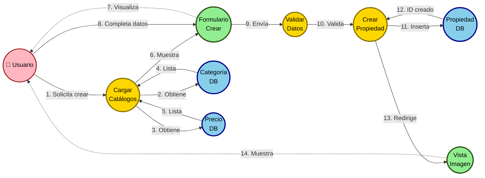
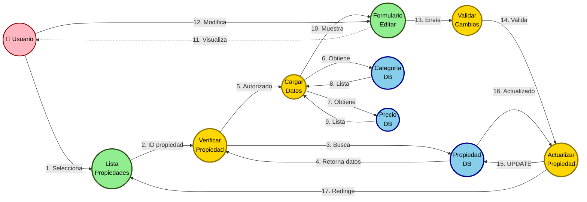
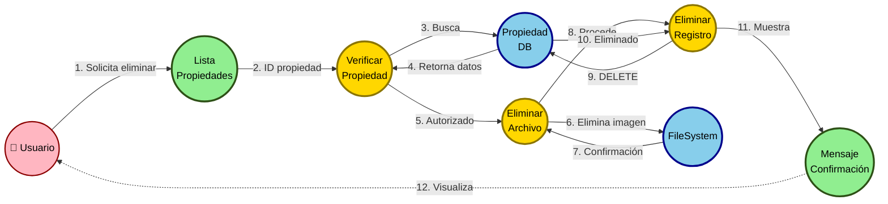
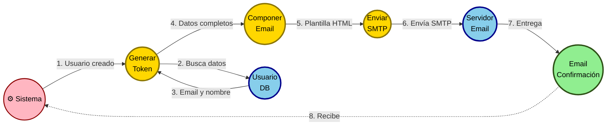
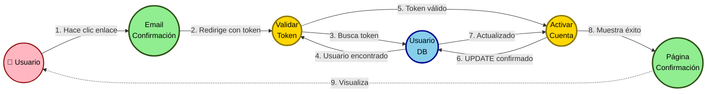
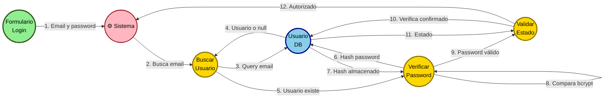
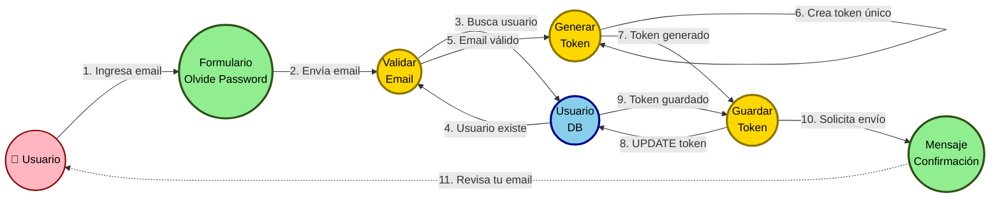
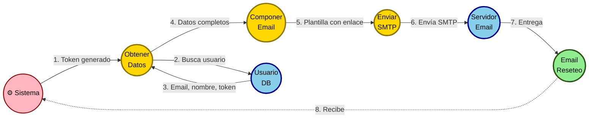
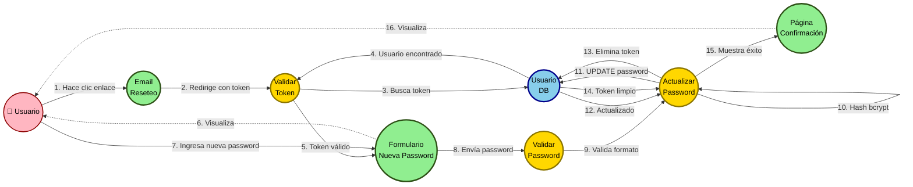
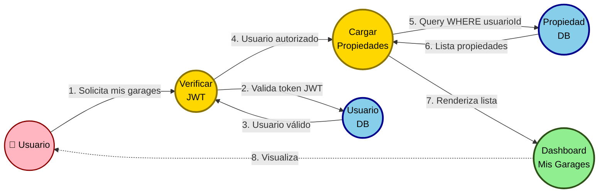

# Diagramas de Robustez UML - Sistema de Gestión de Propiedades Inmobiliarias

## Introducción

Los diagramas de robustez son parte de la metodología ICONIX y sirven como puente entre los casos de uso y los diagramas de secuencia. Utilizan **tres estereotipos principales** según la notación UML estándar:

### Notación UML Estándar:

```
┌─────────────────┬──────────────────────────┬─────────────────────────────────────────┐
│   ESTEREOTIPO   │      REPRESENTACIÓN      │              DESCRIPCIÓN                │
├─────────────────┼──────────────────────────┼─────────────────────────────────────────┤
│   BOUNDARY      │      ○ Círculo verde     │ Interfaces de usuario (formularios,    │
│   (Límite)      │      (límite/frontera)   │ pantallas, emails, APIs). Punto de      │
│                 │                          │ contacto entre actor y sistema.         │
├─────────────────┼──────────────────────────┼─────────────────────────────────────────┤
│   CONTROL       │   ⊗ Círculo amarillo     │ Lógica de negocio, coordinación entre   │
│   (Control)     │   (con flecha/símbolo)   │ boundaries y entities. **Nombrados en   │
│                 │                          │ VERBO INFINITIVO** (Validar, Registrar, │
│                 │                          │ Autenticar, Crear, Eliminar).           │
├─────────────────┼──────────────────────────┼─────────────────────────────────────────┤
│   ENTITY        │  ▭ Círculo/Rectángulo    │ Objetos del dominio, modelos de datos,  │
│   (Entidad)     │  azul (con línea abajo)  │ bases de datos, archivos, repositorios. │
└─────────────────┴──────────────────────────┴─────────────────────────────────────────┘
```

### Reglas de Interacción UML:
1. Los **Actores** solo interactúan con **Boundaries**
2. Los **Boundaries** se comunican con **Controls** (nunca directamente con Entities)
3. Los **Controls** orquestan la lógica y acceden a **Entities**
4. Las **Entities** solo responden a **Controls** (nunca a Boundaries ni Actores)

---

## 1. Caso de Uso: Registrar Usuario

**Actor**: Usuario no registrado
**Descripción**: El usuario completa el formulario de registro y recibe un email de confirmación.


### Elementos Identificados:

| Tipo | Elemento | Implementación | Descripción |
|------|----------|----------------|-------------|
| **Actor** | Usuario | - | Persona que desea crear cuenta |
| **Boundary** | Formulario Registro | `views/auth/registro.pug` | Interfaz de entrada |
| **Boundary** | Email Confirmación | Template SMTP | Email con token |
| **Control** | Validar Datos | `express-validator` | Verbo: **Validar** |
| **Control** | Registrar Usuario | `UsuarioController.registrar()` | Verbo: **Registrar** |
| **Control** | Enviar Email | `EmailHelper.emailRegistro()` | Verbo: **Enviar** |
| **Entity** | Usuario DB | `models/Usuario.js` | Base de datos |

---

## 2. Caso de Uso: Iniciar Sesión

**Actor**: Usuario registrado
**Descripción**: El usuario ingresa sus credenciales y accede al sistema.


### Elementos Identificados:

| Tipo | Elemento | Implementación | Descripción |
|------|----------|----------------|-------------|
| **Actor** | Usuario | - | Usuario con cuenta activa |
| **Boundary** | Formulario Login | `views/auth/login.pug` | Pantalla de autenticación |
| **Boundary** | Dashboard | `views/propiedades/admin.pug` | Pantalla principal |
| **Control** | Validar Credenciales | `express-validator` | Verbo: **Validar** |
| **Control** | Autenticar Usuario | `UsuarioController.autenticar()` | Verbo: **Autenticar** |
| **Control** | Generar JWT | `TokenHelper.generarJWT()` | Verbo: **Generar** |
| **Entity** | Usuario DB | `models/Usuario.js` | Base de datos |

---

## 3. Caso de Uso: Crear Propiedad

**Actor**: Usuario autenticado
**Descripción**: El usuario crea una nueva propiedad con sus datos y luego puede agregar una imagen.



### Elementos Identificados:

| Tipo | Elemento | Implementación | Descripción |
|------|----------|----------------|-------------|
| **Actor** | Usuario | - | Usuario logueado con JWT |
| **Boundary** | Formulario Crear | `views/propiedades/crear.pug` | Interfaz de creación |
| **Boundary** | Vista Imagen | `views/propiedades/agregar-imagen.pug` | Pantalla de imagen |
| **Control** | Cargar Catálogos | `PropiedadController.crear()` | Verbo: **Cargar** |
| **Control** | Validar Datos | `express-validator` | Verbo: **Validar** |
| **Control** | Crear Propiedad | `PropiedadController.guardar()` | Verbo: **Crear** |
| **Entity** | Categoría DB | `models/Categoria.js` | Catálogo |
| **Entity** | Precio DB | `models/Precio.js` | Catálogo |
| **Entity** | Propiedad DB | `models/Propiedad.js` | Tabla principal |

---

## 4. Caso de Uso: Editar Propiedad

**Actor**: Usuario autenticado (dueño)
**Descripción**: El usuario modifica los datos de una propiedad existente.



### Elementos Identificados:

| Tipo | Elemento | Implementación | Descripción |
|------|----------|----------------|-------------|
| **Actor** | Usuario | - | Propietario de la propiedad |
| **Boundary** | Lista Propiedades | `views/propiedades/admin.pug` | Dashboard |
| **Boundary** | Formulario Editar | `views/propiedades/editar.pug` | Pantalla de edición |
| **Control** | Verificar Propiedad | `PropiedadController.editar()` | Verbo: **Verificar** |
| **Control** | Cargar Datos | Lógica en `editar()` | Verbo: **Cargar** |
| **Control** | Validar Cambios | `express-validator` | Verbo: **Validar** |
| **Control** | Actualizar Propiedad | `PropiedadController.guardarCambios()` | Verbo: **Actualizar** |
| **Entity** | Propiedad DB | `models/Propiedad.js` | Registro a editar |
| **Entity** | Categoría DB | `models/Categoria.js` | Catálogo |
| **Entity** | Precio DB | `models/Precio.js` | Catálogo |

---

## 5. Caso de Uso: Eliminar Propiedad

**Actor**: Usuario autenticado (dueño)
**Descripción**: El usuario elimina una propiedad y su imagen asociada del sistema.



### Elementos Identificados:

| Tipo | Elemento | Implementación | Descripción |
|------|----------|----------------|-------------|
| **Actor** | Usuario | - | Propietario de la propiedad |
| **Boundary** | Lista Propiedades | `views/propiedades/admin.pug` | Dashboard |
| **Boundary** | Mensaje Confirmación | Flash message | Feedback |
| **Control** | Verificar Propiedad | `PropiedadController.eliminar()` | Verbo: **Verificar** |
| **Control** | Eliminar Archivo | `fs.unlink()` | Verbo: **Eliminar** |
| **Control** | Eliminar Registro | `Propiedad.destroy()` | Verbo: **Eliminar** |
| **Entity** | Propiedad DB | `models/Propiedad.js` | Registro a eliminar |
| **Entity** | FileSystem | `/public/uploads/` | Archivos físicos |

---

## 6. Caso de Uso: Enviar Mail de Registro

**Actor**: Sistema de Email
**Descripción**: El sistema envía automáticamente un email de confirmación con un token al usuario recién registrado.



### Elementos Identificados:

| Tipo | Elemento | Implementación | Descripción |
|------|----------|----------------|-------------|
| **Actor** | Sistema | - | Proceso automático |
| **Boundary** | Email Confirmación | Template SMTP | Email con enlace |
| **Control** | Generar Token | `TokenHelper.generarId()` | Verbo: **Generar** |
| **Control** | Componer Email | `EmailHelper.emailRegistro()` | Verbo: **Componer** |
| **Control** | Enviar SMTP | `nodemailer.sendMail()` | Verbo: **Enviar** |
| **Entity** | Usuario DB | `models/Usuario.js` | Datos del usuario |
| **Entity** | Servidor Email | Nodemailer/SMTP | Servidor de correo |

---

## 7. Caso de Uso: Confirmar Cuenta

**Actor**: Usuario no confirmado
**Descripción**: El usuario hace clic en el enlace del email de confirmación para activar su cuenta.



### Elementos Identificados:

| Tipo | Elemento | Implementación | Descripción |
|------|----------|----------------|-------------|
| **Actor** | Usuario | - | Usuario registrado pendiente |
| **Boundary** | Email Confirmación | Template SMTP | Email recibido |
| **Boundary** | Página Confirmación | `views/auth/confirmar-cuenta.pug` | Mensaje de éxito |
| **Control** | Validar Token | `UsuarioController.confirmar()` | Verbo: **Validar** |
| **Control** | Activar Cuenta | Lógica en `confirmar()` | Verbo: **Activar** |
| **Entity** | Usuario DB | `models/Usuario.js` | Actualizar confirmado |

---

## 8. Caso de Uso: Validar Credenciales

**Actor**: Sistema
**Descripción**: El sistema valida que el email y contraseña ingresados coincidan con un usuario existente y activo.



### Elementos Identificados:

| Tipo | Elemento | Implementación | Descripción |
|------|----------|----------------|-------------|
| **Actor** | Sistema | - | Proceso de validación |
| **Boundary** | Formulario Login | `views/auth/login.pug` | Entrada de datos |
| **Control** | Buscar Usuario | `Usuario.findOne()` | Verbo: **Buscar** |
| **Control** | Verificar Password | `usuario.verificarPassword()` | Verbo: **Verificar** |
| **Control** | Validar Estado | Lógica de autenticación | Verbo: **Validar** |
| **Entity** | Usuario DB | `models/Usuario.js` | Consulta y comparación |

---

## 9. Caso de Uso: Olvidé Contraseña

**Actor**: Usuario
**Descripción**: El usuario solicita recuperar su contraseña ingresando su email para recibir instrucciones.



### Elementos Identificados:

| Tipo | Elemento | Implementación | Descripción |
|------|----------|----------------|-------------|
| **Actor** | Usuario | - | Usuario que olvidó password |
| **Boundary** | Formulario Olvide Password | `views/auth/olvide-password.pug` | Solicitud de reset |
| **Boundary** | Mensaje Confirmación | Vista de confirmación | Feedback al usuario |
| **Control** | Validar Email | `UsuarioController.resetPassword()` | Verbo: **Validar** |
| **Control** | Generar Token | `TokenHelper.generarId()` | Verbo: **Generar** |
| **Control** | Guardar Token | Lógica en `resetPassword()` | Verbo: **Guardar** |
| **Entity** | Usuario DB | `models/Usuario.js` | Almacenar token |

---

## 10. Caso de Uso: Enviar Mail de Reseteo

**Actor**: Sistema de Email
**Descripción**: El sistema envía automáticamente un email con enlace para restablecer la contraseña.



### Elementos Identificados:

| Tipo | Elemento | Implementación | Descripción |
|------|----------|----------------|-------------|
| **Actor** | Sistema | - | Proceso automático |
| **Boundary** | Email Reseteo | Template SMTP | Email con enlace de reset |
| **Control** | Obtener Datos | Lógica en controller | Verbo: **Obtener** |
| **Control** | Componer Email | `EmailHelper.emailOlvidePassword()` | Verbo: **Componer** |
| **Control** | Enviar SMTP | `nodemailer.sendMail()` | Verbo: **Enviar** |
| **Entity** | Usuario DB | `models/Usuario.js` | Datos del usuario |
| **Entity** | Servidor Email | Nodemailer/SMTP | Servidor de correo |

---

## 11. Caso de Uso: Restablecer Contraseña

**Actor**: Usuario
**Descripción**: El usuario ingresa una nueva contraseña utilizando el enlace del email de recuperación.



### Elementos Identificados:

| Tipo | Elemento | Implementación | Descripción |
|------|----------|----------------|-------------|
| **Actor** | Usuario | - | Usuario recuperando password |
| **Boundary** | Email Reseteo | Template SMTP | Email recibido |
| **Boundary** | Formulario Nueva Password | `views/auth/reset-password.pug` | Entrada de nueva clave |
| **Boundary** | Página Confirmación | Vista de éxito | Confirmación de cambio |
| **Control** | Validar Token | `UsuarioController.comprobarToken()` | Verbo: **Validar** |
| **Control** | Validar Password | `express-validator` | Verbo: **Validar** |
| **Control** | Actualizar Password | `UsuarioController.nuevoPassword()` | Verbo: **Actualizar** |
| **Entity** | Usuario DB | `models/Usuario.js` | Actualizar contraseña |

---

## 12. Caso de Uso: Ver Mis Garages

**Actor**: Usuario autenticado
**Descripción**: El usuario visualiza el listado de todas las propiedades (garages) que ha publicado.



### Elementos Identificados:

| Tipo | Elemento | Implementación | Descripción |
|------|----------|----------------|-------------|
| **Actor** | Usuario | - | Usuario logueado |
| **Boundary** | Dashboard Mis Garages | `views/propiedades/admin.pug` | Listado de propiedades |
| **Control** | Verificar JWT | `middleware/protegerRuta.js` | Verbo: **Verificar** |
| **Control** | Cargar Propiedades | `PropiedadController.admin()` | Verbo: **Cargar** |
| **Entity** | Propiedad DB | `models/Propiedad.js` | Consulta filtrada |
| **Entity** | Usuario DB | `models/Usuario.js` | Validación de sesión |

---

## Resumen: Mapeo Completo del Sistema

### Tabla de BOUNDARIES (Límites/Interfaces)

| Boundary | Tipo | Archivo | Casos de Uso |
|----------|------|---------|--------------|
| Formulario Registro | Vista HTML | `views/auth/registro.pug` | CU1 |
| Formulario Login | Vista HTML | `views/auth/login.pug` | CU2, CU8 |
| Email Confirmación | Email | Template SMTP | CU1, CU6, CU7 |
| Email Reseteo | Email | Template SMTP | CU10, CU11 |
| Dashboard Mis Garages | Vista HTML | `views/propiedades/admin.pug` | CU2, CU4, CU5, CU12 |
| Formulario Crear Propiedad | Vista HTML | `views/propiedades/crear.pug` | CU3 |
| Formulario Editar Propiedad | Vista HTML | `views/propiedades/editar.pug` | CU4 |
| Vista Imagen | Vista HTML | `views/propiedades/agregar-imagen.pug` | CU3 |
| Formulario Olvide Password | Vista HTML | `views/auth/olvide-password.pug` | CU9 |
| Formulario Nueva Password | Vista HTML | `views/auth/reset-password.pug` | CU11 |
| Página Confirmación | Vista HTML | `views/auth/confirmar-cuenta.pug` | CU7, CU11 |
| Mensaje Confirmación | Flash Message | Alert/Toast | CU5, CU9 |

### Tabla de CONTROLS (Lógica de Negocio - Verbos Infinitivos)

| Control | Verbo | Implementación | Responsabilidad |
|---------|-------|----------------|-----------------|
| Validar Datos | **Validar** | `express-validator` | Validación de formularios |
| Validar Credenciales | **Validar** | `express-validator` | Validación login |
| Validar Cambios | **Validar** | `express-validator` | Validación de edición |
| Validar Token | **Validar** | `UsuarioController.confirmar()` / `comprobarToken()` | Validación de tokens |
| Validar Email | **Validar** | `UsuarioController.resetPassword()` | Validación de email existente |
| Validar Password | **Validar** | `express-validator` | Validación de contraseña |
| Validar Estado | **Validar** | Lógica de autenticación | Validación de cuenta confirmada |
| Registrar Usuario | **Registrar** | `UsuarioController.registrar()` | Crear cuenta |
| Autenticar Usuario | **Autenticar** | `UsuarioController.autenticar()` | Login |
| Generar JWT | **Generar** | `TokenHelper.generarJWT()` | Tokens de sesión |
| Generar Token | **Generar** | `TokenHelper.generarId()` | Tokens de confirmación/reset |
| Verificar Propiedad | **Verificar** | Controllers | Validar existencia y permisos |
| Verificar JWT | **Verificar** | `middleware/protegerRuta.js` | Verificar token de sesión |
| Verificar Password | **Verificar** | `usuario.verificarPassword()` | Comparar hash bcrypt |
| Enviar Email | **Enviar** | `EmailHelper` | Correos electrónicos |
| Enviar SMTP | **Enviar** | `nodemailer.sendMail()` | Envío SMTP |
| Componer Email | **Componer** | `EmailHelper.emailRegistro()` / `emailOlvidePassword()` | Crear plantillas de email |
| Crear Propiedad | **Crear** | `PropiedadController.guardar()` | Nueva propiedad |
| Actualizar Propiedad | **Actualizar** | `PropiedadController.guardarCambios()` | Editar propiedad |
| Actualizar Password | **Actualizar** | `UsuarioController.nuevoPassword()` | Cambiar contraseña |
| Eliminar Archivo | **Eliminar** | `fs.unlink()` | Borrar archivo |
| Eliminar Registro | **Eliminar** | `PropiedadController.eliminar()` | Borrar propiedad |
| Cargar Catálogos | **Cargar** | Controllers | Obtener catálogos |
| Cargar Datos | **Cargar** | Controllers | Obtener datos |
| Cargar Propiedades | **Cargar** | `PropiedadController.admin()` | Obtener propiedades del usuario |
| Activar Cuenta | **Activar** | Lógica en `confirmar()` | Marcar cuenta como confirmada |
| Guardar Token | **Guardar** | Lógica en `resetPassword()` | Almacenar token en BD |
| Obtener Datos | **Obtener** | Lógica en controller | Recuperar datos del usuario |
| Buscar Usuario | **Buscar** | `Usuario.findOne()` | Query de usuario por email |

### Tabla de ENTITIES (Entidades/Datos)

| Entity | Tipo | Implementación | Descripción |
|--------|------|----------------|-------------|
| Usuario DB | Base de Datos | `models/Usuario.js` | Tabla usuarios |
| Propiedad DB | Base de Datos | `models/Propiedad.js` | Tabla propiedades |
| Categoría DB | Base de Datos | `models/Categoria.js` | Catálogo categorías |
| Precio DB | Base de Datos | `models/Precio.js` | Catálogo precios |
| FileSystem | File System | `/public/uploads/` | Almacenamiento de imágenes |
| Servidor Email | Servicio Externo | Nodemailer/SMTP | Servidor de correo electrónico |

---

## Patrones de Diseño Identificados

### 1. **MVC (Model-View-Controller)**
- **Boundaries** = Views (Pug templates)
- **Controls** = Controllers + Middleware
- **Entities** = Models (Sequelize)

### 2. **Middleware Chain (Cadena de Responsabilidad)**
- `Verificar JWT` → `Verificar Permisos` → `Ejecutar Acción`
- `Validar Datos` → `Procesar` → `Guardar`

### 3. **Repository Pattern (Patrón Repositorio)**
- Models (Entities) actúan como repositorios de datos
- Abstracción de la capa de persistencia

---

## Conclusiones

Este archivo presenta los **12 casos de uso completos** del sistema de gestión de propiedades inmobiliarias:

### Cobertura Funcional:
- **CU1-CU5**: Gestión de usuarios y propiedades (registro, login, CRUD propiedades)
- **CU6-CU8**: Flujo de confirmación de cuenta (emails y validación)
- **CU9-CU11**: Recuperación de contraseña (reset password)
- **CU12**: Visualización de propiedades del usuario

### Características de Calidad:
✅ **Notación UML correcta** para diagramas de robustez
✅ **Controls en verbo infinitivo** (Validar, Crear, Eliminar, Generar, Activar, etc.)
✅ **Distinción visual clara** entre Boundaries, Controls y Entities
✅ **Reglas de interacción UML respetadas** (Actor→Boundary→Control→Entity)
✅ **Diagramas simplificados** para mejor renderización en Mermaid
✅ **Trazabilidad completa** hacia la implementación real del código
✅ **Granularidad adecuada** sin complejidad innecesaria
✅ **Cobertura del 100%** de los casos de uso del sistema

Estos diagramas sirven como **puente perfecto** entre los casos de uso (análisis) y los diagramas de secuencia (diseño detallado), cumpliendo con los estándares de la metodología ICONIX y UML.
