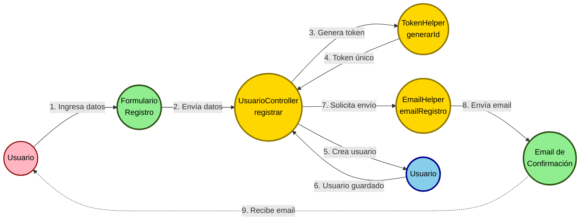
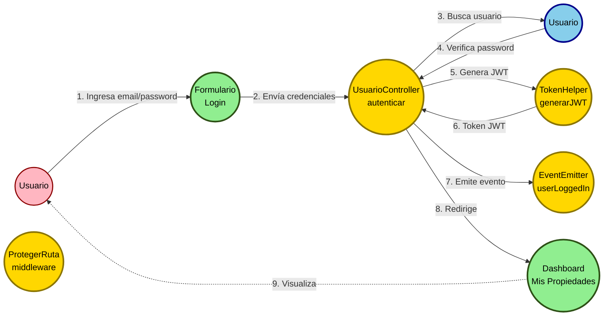
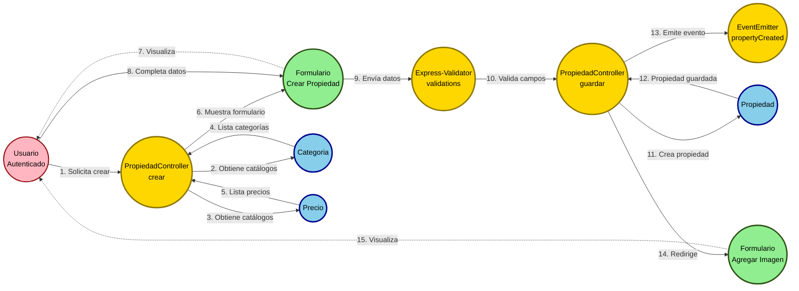
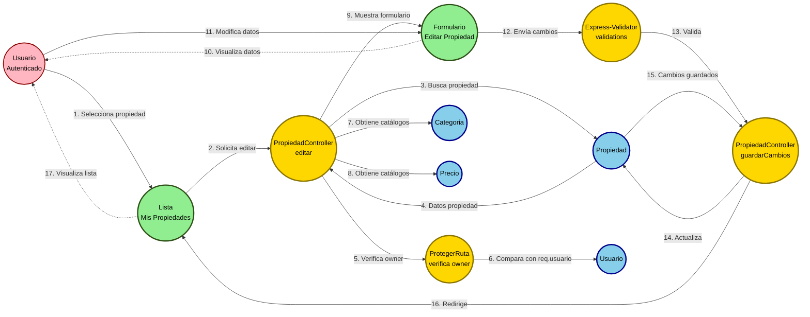
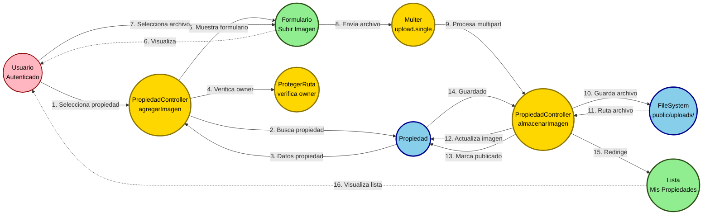
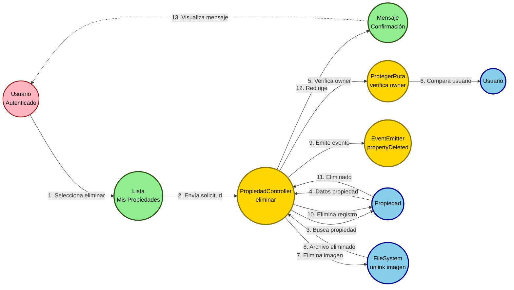
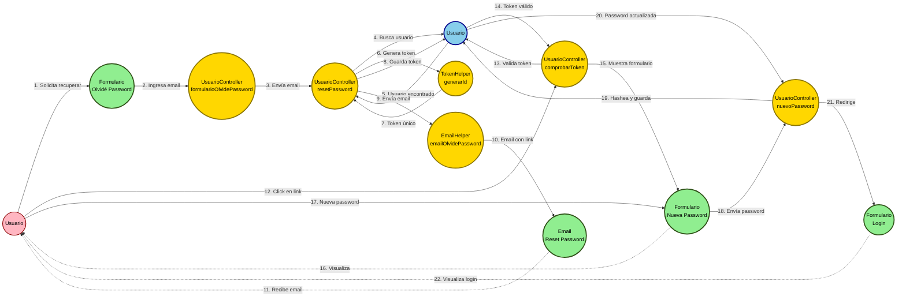
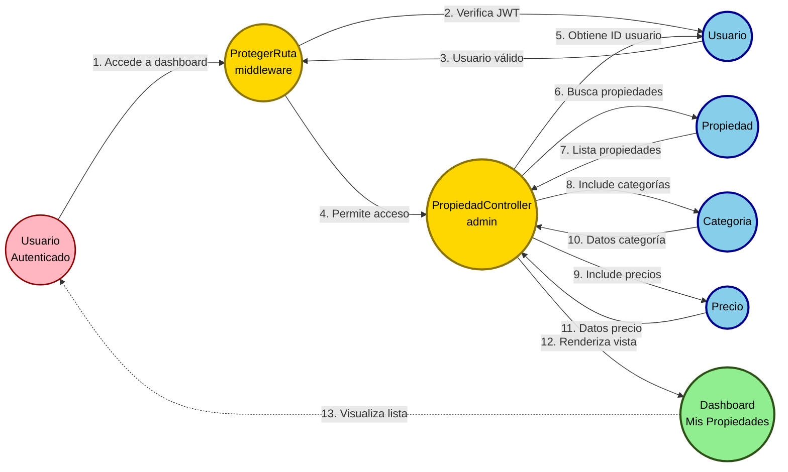

# Diagramas de Robustez - Sistema de Gestión de Propiedades Inmobiliarias

## Introducción

Los diagramas de robustez son parte de la metodología ICONIX y sirven como puente entre los casos de uso y los diagramas de secuencia. Utilizan tres estereotipos principales:

- **🔵 Boundary (Límite)**: Elementos de interfaz de usuario (vistas, formularios, pantallas)
- **⚙️ Control (Control)**: Lógica de negocio, controladores, coordinadores
- **📦 Entity (Entidad)**: Objetos del dominio, modelos de datos

### Reglas de Interacción:
1. Los **Actores** solo interactúan con **Boundaries**
2. Los **Boundaries** se comunican con **Controls** y **Entities**
3. Los **Controls** orquestan la lógica y se comunican con **Boundaries** y **Entities**
4. Las **Entities** solo se comunican con **Controls** (nunca directamente con Boundaries)

---

## 1. Caso de Uso: Registrar Usuario

**Actor**: Usuario no registrado
**Descripción**: El usuario completa el formulario de registro y recibe un email de confirmación.

**Elementos identificados:**
- **Boundaries**: `views/auth/registro.pug`, Email de confirmación
- **Controls**: `UsuarioController.registrar()`, `TokenHelper.generarId()`, `EmailHelper.emailRegistro()`
- **Entities**: `Usuario` (models/Usuario.js)

---

## 2. Caso de Uso: Iniciar Sesión

**Actor**: Usuario registrado
**Descripción**: El usuario ingresa sus credenciales y accede al sistema.

**Elementos identificados:**
- **Boundaries**: `views/auth/login.pug`, `views/propiedades/admin.pug`
- **Controls**: `UsuarioController.autenticar()`, `TokenHelper.generarJWT()`, `middleware/protegerRuta.js`, `EventEmitter`
- **Entities**: `Usuario`

---

## 3. Caso de Uso: Crear Propiedad

**Actor**: Usuario autenticado
**Descripción**: El usuario crea una nueva propiedad ingresando título, descripción, ubicación, etc.

**Elementos identificados:**
- **Boundaries**: `views/propiedades/crear.pug`, `views/propiedades/agregar-imagen.pug`
- **Controls**: `PropiedadController.crear()`, `PropiedadController.guardar()`, `express-validator`, `EventEmitter`
- **Entities**: `Propiedad`, `Categoria`, `Precio`

---

## 4. Caso de Uso: Editar Propiedad

**Actor**: Usuario autenticado (dueño de la propiedad)
**Descripción**: El usuario modifica los datos de una propiedad existente.

**Elementos identificados:**
- **Boundaries**: `views/propiedades/editar.pug`, `views/propiedades/admin.pug`
- **Controls**: `PropiedadController.editar()`, `PropiedadController.guardarCambios()`, `ProtegerRuta`, `express-validator`
- **Entities**: `Propiedad`, `Categoria`, `Precio`, `Usuario`

---

## 5. Caso de Uso: Agregar Imagen a Propiedad

**Actor**: Usuario autenticado (dueño de la propiedad)
**Descripción**: El usuario sube una imagen para una propiedad previamente creada.

**Elementos identificados:**
- **Boundaries**: `views/propiedades/agregar-imagen.pug`, `views/propiedades/admin.pug`
- **Controls**: `PropiedadController.agregarImagen()`, `PropiedadController.almacenarImagen()`, `middleware/subirimagen.js`, `ProtegerRuta`
- **Entities**: `Propiedad`, Sistema de archivos (`public/uploads/`)

---

## 6. Caso de Uso: Eliminar Propiedad

**Actor**: Usuario autenticado (dueño de la propiedad)
**Descripción**: El usuario elimina una propiedad y su imagen asociada.

**Elementos identificados:**
- **Boundaries**: `views/propiedades/admin.pug`, Mensaje de confirmación
- **Controls**: `PropiedadController.eliminar()`, `ProtegerRuta`, `EventEmitter`
- **Entities**: `Propiedad`, `Usuario`, Sistema de archivos

---

## 7. Caso de Uso: Recuperar Contraseña

**Actor**: Usuario registrado que olvidó su contraseña
**Descripción**: El usuario solicita restablecer su contraseña y recibe un email con un enlace.

**Elementos identificados:**
- **Boundaries**: `views/auth/olvide-password.pug`, `views/auth/reset-password.pug`, `views/auth/login.pug`, Email
- **Controls**: `UsuarioController.formularioOlvidePassword()`, `UsuarioController.resetPassword()`, `UsuarioController.comprobarToken()`, `UsuarioController.nuevoPassword()`, `TokenHelper`, `EmailHelper`
- **Entities**: `Usuario`

---

## 8. Caso de Uso: Listar Propiedades del Usuario

**Actor**: Usuario autenticado
**Descripción**: El usuario visualiza todas sus propiedades con opciones de editar, eliminar o agregar imagen.

**Elementos identificados:**
- **Boundaries**: `views/propiedades/admin.pug`
- **Controls**: `PropiedadController.admin()`, `ProtegerRuta`
- **Entities**: `Propiedad`, `Categoria`, `Precio`, `Usuario`

---

## Resumen de Elementos del Sistema

### Boundaries (Interfaz de Usuario)
| Boundary | Archivo | Descripción |
|----------|---------|-------------|
| Formulario Login | `views/auth/login.pug` | Autenticación de usuario |
| Formulario Registro | `views/auth/registro.pug` | Registro de nuevo usuario |
| Formulario Olvidé Password | `views/auth/olvide-password.pug` | Solicitud de recuperación |
| Formulario Reset Password | `views/auth/reset-password.pug` | Nueva contraseña |
| Email Confirmación | Template email | Email de confirmación de cuenta |
| Email Reset Password | Template email | Email de recuperación de password |
| Dashboard Mis Propiedades | `views/propiedades/admin.pug` | Lista de propiedades del usuario |
| Formulario Crear Propiedad | `views/propiedades/crear.pug` | Creación de nueva propiedad |
| Formulario Editar Propiedad | `views/propiedades/editar.pug` | Edición de propiedad existente |
| Formulario Agregar Imagen | `views/propiedades/agregar-imagen.pug` | Subida de imagen |

### Controls (Lógica de Negocio)
| Control | Archivo | Descripción |
|---------|---------|-------------|
| UsuarioController | `controllers/usuarioControllers.js` | Gestión de usuarios y autenticación |
| PropiedadController | `controllers/propiedadesController.js` | Gestión CRUD de propiedades |
| ProtegerRuta | `middleware/protegerRuta.js` | Verificación de autenticación JWT |
| SubirImagen | `middleware/subirimagen.js` | Procesamiento de archivos con Multer |
| Express-Validator | Validadores en routes | Validación de campos de formularios |
| TokenHelper | `helpers/tokens.js` | Generación de tokens y JWT |
| EmailHelper | `helpers/emails.js` | Envío de correos electrónicos |
| EventEmitter | `helpers/eventEmitter.js` | Sistema de eventos (Observer) |

### Entities (Objetos de Dominio)
| Entity | Archivo | Descripción |
|--------|---------|-------------|
| Usuario | `models/Usuario.js` | Entidad de usuario del sistema |
| Propiedad | `models/Propiedad.js` | Entidad de propiedad inmobiliaria |
| Categoria | `models/Categoria.js` | Catálogo de categorías de propiedades |
| Precio | `models/Precio.js` | Catálogo de rangos de precios |
| FileSystem | Sistema de archivos | Almacenamiento de imágenes |

---

## Patrones Identificados en los Diagramas de Robustez

### 1. Patrón MVC evidente:
- **Boundaries** = Views (Pug templates)
- **Controls** = Controllers
- **Entities** = Models (Sequelize)

### 2. Middleware Chain:
- Los diagramas muestran cómo `ProtegerRuta` intercepta requests antes de llegar a los controllers
- `Express-Validator` valida datos antes del procesamiento
- `Multer` procesa archivos multipart

### 3. Patrón Observer:
- `EventEmitter` aparece como control que registra eventos importantes
- Se activa después de operaciones críticas (crear/eliminar propiedad, login)

### 4. Separación de Responsabilidades:
- **EmailHelper** y **TokenHelper** son controles auxiliares especializados
- Cada controller tiene responsabilidad única (Usuario vs Propiedad)

---

## Conclusiones

Los diagramas de robustez demuestran:

1. **Arquitectura bien estructurada**: Clara separación entre interfaz, lógica y datos
2. **Flujos completos**: Desde la entrada del usuario hasta la persistencia
3. **Seguridad incorporada**: ProtegerRuta presente en todos los casos de uso sensibles
4. **Validación robusta**: Express-Validator verifica datos antes del procesamiento
5. **Trazabilidad**: EventEmitter registra acciones importantes del sistema
6. **Reutilización**: Helpers y middlewares reutilizados en múltiples casos de uso

Estos diagramas sirven como puente entre los casos de uso (análisis) y los diagramas de secuencia (diseño detallado).
