# Diagramas de Robustez - Sistema de Gestión de Propiedades Inmobiliarias

## Introducción

Los diagramas de robustez son parte de la metodología ICONIX y sirven como puente entre los casos de uso y los diagramas de secuencia. Utilizan tres estereotipos principales:

- **🔵 Boundary (Límite)**: Elementos de interfaz de usuario (vistas, formularios, pantallas)
- **⚙️ Control (Control)**: Lógica de negocio, controladores, coordinadores
- **📦 Entity (Entidad)**: Objetos del dominio, modelos de datos

### Reglas de Interacción:
1. Los **Actores** solo interactúan con **Boundaries**
2. Los **Boundaries** se comunican con **Controls** y **Entities**
3. Los **Controls** orquestan la lógica y se comunican con **Boundaries** y **Entities**
4. Las **Entities** solo se comunican con **Controls** (nunca directamente con Boundaries)

---

## 1. Caso de Uso: Registrar Usuario

**Actor**: Usuario no registrado
**Descripción**: El usuario completa el formulario de registro y recibe un email de confirmación.

```mermaid
graph LR
    Actor((Usuario))

    %% Boundaries
    FormRegistro([Formulario<br/>Registro])
    EmailConf([Email de<br/>Confirmación])

    %% Controls
    RegistrarCtrl[UsuarioController<br/>registrar]
    TokenCtrl[TokenHelper<br/>generarId]
    EmailCtrl[EmailHelper<br/>emailRegistro]

    %% Entities
    UsuarioEnt[(Usuario)]

    Actor -->|1. Ingresa datos| FormRegistro
    FormRegistro -->|2. Envía datos| RegistrarCtrl
    RegistrarCtrl -->|3. Genera token| TokenCtrl
    TokenCtrl -->|4. Token único| RegistrarCtrl
    RegistrarCtrl -->|5. Crea usuario| UsuarioEnt
    UsuarioEnt -->|6. Usuario guardado| RegistrarCtrl
    RegistrarCtrl -->|7. Solicita envío| EmailCtrl
    EmailCtrl -->|8. Envía email| EmailConf
    EmailConf -.->|9. Recibe email| Actor

    classDef boundary fill:#90EE90,stroke:#333,stroke-width:3px
    classDef control fill:#FFD700,stroke:#333,stroke-width:2px
    classDef entity fill:#87CEEB,stroke:#333,stroke-width:2px

    class FormRegistro,EmailConf boundary
    class RegistrarCtrl,TokenCtrl,EmailCtrl control
    class UsuarioEnt entity
```

**Elementos identificados:**
- **Boundaries**: `views/auth/registro.pug`, Email de confirmación
- **Controls**: `UsuarioController.registrar()`, `TokenHelper.generarId()`, `EmailHelper.emailRegistro()`
- **Entities**: `Usuario` (models/Usuario.js)

---

## 2. Caso de Uso: Iniciar Sesión

**Actor**: Usuario registrado
**Descripción**: El usuario ingresa sus credenciales y accede al sistema.

```mermaid
graph LR
    Actor((Usuario))

    %% Boundaries
    FormLogin([Formulario<br/>Login])
    Dashboard([Dashboard<br/>Mis Propiedades])

    %% Controls
    AutenticarCtrl[UsuarioController<br/>autenticar]
    TokenCtrl[TokenHelper<br/>generarJWT]
    ProtegerCtrl[ProtegerRuta<br/>middleware]
    EventCtrl[EventEmitter<br/>userLoggedIn]

    %% Entities
    UsuarioEnt[(Usuario)]

    Actor -->|1. Ingresa email/password| FormLogin
    FormLogin -->|2. Envía credenciales| AutenticarCtrl
    AutenticarCtrl -->|3. Busca usuario| UsuarioEnt
    UsuarioEnt -->|4. Verifica password| AutenticarCtrl
    AutenticarCtrl -->|5. Genera JWT| TokenCtrl
    TokenCtrl -->|6. Token JWT| AutenticarCtrl
    AutenticarCtrl -->|7. Emite evento| EventCtrl
    AutenticarCtrl -->|8. Redirige| Dashboard
    Dashboard -.->|9. Visualiza| Actor

    classDef boundary fill:#90EE90,stroke:#333,stroke-width:3px
    classDef control fill:#FFD700,stroke:#333,stroke-width:2px
    classDef entity fill:#87CEEB,stroke:#333,stroke-width:2px

    class FormLogin,Dashboard boundary
    class AutenticarCtrl,TokenCtrl,ProtegerCtrl,EventCtrl control
    class UsuarioEnt entity
```

**Elementos identificados:**
- **Boundaries**: `views/auth/login.pug`, `views/propiedades/admin.pug`
- **Controls**: `UsuarioController.autenticar()`, `TokenHelper.generarJWT()`, `middleware/protegerRuta.js`, `EventEmitter`
- **Entities**: `Usuario`

---

## 3. Caso de Uso: Crear Propiedad

**Actor**: Usuario autenticado
**Descripción**: El usuario crea una nueva propiedad ingresando título, descripción, ubicación, etc.

```mermaid
graph LR
    Actor((Usuario<br/>Autenticado))

    %% Boundaries
    FormCrear([Formulario<br/>Crear Propiedad])
    FormImagen([Formulario<br/>Agregar Imagen])

    %% Controls
    CrearCtrl[PropiedadController<br/>crear]
    GuardarCtrl[PropiedadController<br/>guardar]
    ValidarCtrl[Express-Validator<br/>body validations]
    EventCtrl[EventEmitter<br/>propertyCreated]

    %% Entities
    PropiedadEnt[(Propiedad)]
    CategoriaEnt[(Categoria)]
    PrecioEnt[(Precio)]

    Actor -->|1. Solicita crear| CrearCtrl
    CrearCtrl -->|2. Obtiene catálogos| CategoriaEnt
    CrearCtrl -->|3. Obtiene catálogos| PrecioEnt
    CategoriaEnt -->|4. Lista categorías| CrearCtrl
    PrecioEnt -->|5. Lista precios| CrearCtrl
    CrearCtrl -->|6. Muestra formulario| FormCrear
    FormCrear -.->|7. Visualiza| Actor
    Actor -->|8. Completa datos| FormCrear
    FormCrear -->|9. Envía datos| ValidarCtrl
    ValidarCtrl -->|10. Valida campos| GuardarCtrl
    GuardarCtrl -->|11. Crea propiedad| PropiedadEnt
    PropiedadEnt -->|12. Propiedad guardada| GuardarCtrl
    GuardarCtrl -->|13. Emite evento| EventCtrl
    GuardarCtrl -->|14. Redirige| FormImagen
    FormImagen -.->|15. Visualiza| Actor

    classDef boundary fill:#90EE90,stroke:#333,stroke-width:3px
    classDef control fill:#FFD700,stroke:#333,stroke-width:2px
    classDef entity fill:#87CEEB,stroke:#333,stroke-width:2px

    class FormCrear,FormImagen boundary
    class CrearCtrl,GuardarCtrl,ValidarCtrl,EventCtrl control
    class PropiedadEnt,CategoriaEnt,PrecioEnt entity
```

**Elementos identificados:**
- **Boundaries**: `views/propiedades/crear.pug`, `views/propiedades/agregar-imagen.pug`
- **Controls**: `PropiedadController.crear()`, `PropiedadController.guardar()`, `express-validator`, `EventEmitter`
- **Entities**: `Propiedad`, `Categoria`, `Precio`

---

## 4. Caso de Uso: Editar Propiedad

**Actor**: Usuario autenticado (dueño de la propiedad)
**Descripción**: El usuario modifica los datos de una propiedad existente.

```mermaid
graph LR
    Actor((Usuario<br/>Autenticado))

    %% Boundaries
    FormEditar([Formulario<br/>Editar Propiedad])
    ListaProp([Lista<br/>Mis Propiedades])

    %% Controls
    EditarCtrl[PropiedadController<br/>editar]
    GuardarCambiosCtrl[PropiedadController<br/>guardarCambios]
    ValidarCtrl[Express-Validator<br/>validations]
    ProtegerCtrl[ProtegerRuta<br/>verifica owner]

    %% Entities
    PropiedadEnt[(Propiedad)]
    CategoriaEnt[(Categoria)]
    PrecioEnt[(Precio)]
    UsuarioEnt[(Usuario)]

    Actor -->|1. Selecciona propiedad| ListaProp
    ListaProp -->|2. Solicita editar| EditarCtrl
    EditarCtrl -->|3. Busca propiedad| PropiedadEnt
    PropiedadEnt -->|4. Datos propiedad| EditarCtrl
    EditarCtrl -->|5. Verifica owner| ProtegerCtrl
    ProtegerCtrl -->|6. Compara con req.usuario| UsuarioEnt
    EditarCtrl -->|7. Obtiene catálogos| CategoriaEnt
    EditarCtrl -->|8. Obtiene catálogos| PrecioEnt
    EditarCtrl -->|9. Muestra formulario| FormEditar
    FormEditar -.->|10. Visualiza datos| Actor
    Actor -->|11. Modifica datos| FormEditar
    FormEditar -->|12. Envía cambios| ValidarCtrl
    ValidarCtrl -->|13. Valida| GuardarCambiosCtrl
    GuardarCambiosCtrl -->|14. Actualiza| PropiedadEnt
    PropiedadEnt -->|15. Cambios guardados| GuardarCambiosCtrl
    GuardarCambiosCtrl -->|16. Redirige| ListaProp
    ListaProp -.->|17. Visualiza lista| Actor

    classDef boundary fill:#90EE90,stroke:#333,stroke-width:3px
    classDef control fill:#FFD700,stroke:#333,stroke-width:2px
    classDef entity fill:#87CEEB,stroke:#333,stroke-width:2px

    class FormEditar,ListaProp boundary
    class EditarCtrl,GuardarCambiosCtrl,ValidarCtrl,ProtegerCtrl control
    class PropiedadEnt,CategoriaEnt,PrecioEnt,UsuarioEnt entity
```

**Elementos identificados:**
- **Boundaries**: `views/propiedades/editar.pug`, `views/propiedades/admin.pug`
- **Controls**: `PropiedadController.editar()`, `PropiedadController.guardarCambios()`, `ProtegerRuta`, `express-validator`
- **Entities**: `Propiedad`, `Categoria`, `Precio`, `Usuario`

---

## 5. Caso de Uso: Agregar Imagen a Propiedad

**Actor**: Usuario autenticado (dueño de la propiedad)
**Descripción**: El usuario sube una imagen para una propiedad previamente creada.

```mermaid
graph LR
    Actor((Usuario<br/>Autenticado))

    %% Boundaries
    FormImagen([Formulario<br/>Subir Imagen])
    ListaProp([Lista<br/>Mis Propiedades])

    %% Controls
    AgregarImgCtrl[PropiedadController<br/>agregarImagen]
    AlmacenarImgCtrl[PropiedadController<br/>almacenarImagen]
    UploadCtrl[Multer<br/>upload.single]
    ProtegerCtrl[ProtegerRuta<br/>verifica owner]

    %% Entities
    PropiedadEnt[(Propiedad)]
    FileSystem[(FileSystem<br/>public/uploads/)]

    Actor -->|1. Selecciona propiedad| AgregarImgCtrl
    AgregarImgCtrl -->|2. Busca propiedad| PropiedadEnt
    PropiedadEnt -->|3. Datos propiedad| AgregarImgCtrl
    AgregarImgCtrl -->|4. Verifica owner| ProtegerCtrl
    AgregarImgCtrl -->|5. Muestra formulario| FormImagen
    FormImagen -.->|6. Visualiza| Actor
    Actor -->|7. Selecciona archivo| FormImagen
    FormImagen -->|8. Envía archivo| UploadCtrl
    UploadCtrl -->|9. Procesa multipart| AlmacenarImgCtrl
    AlmacenarImgCtrl -->|10. Guarda archivo| FileSystem
    FileSystem -->|11. Ruta archivo| AlmacenarImgCtrl
    AlmacenarImgCtrl -->|12. Actualiza imagen| PropiedadEnt
    AlmacenarImgCtrl -->|13. Marca publicado| PropiedadEnt
    PropiedadEnt -->|14. Guardado| AlmacenarImgCtrl
    AlmacenarImgCtrl -->|15. Redirige| ListaProp
    ListaProp -.->|16. Visualiza lista| Actor

    classDef boundary fill:#90EE90,stroke:#333,stroke-width:3px
    classDef control fill:#FFD700,stroke:#333,stroke-width:2px
    classDef entity fill:#87CEEB,stroke:#333,stroke-width:2px

    class FormImagen,ListaProp boundary
    class AgregarImgCtrl,AlmacenarImgCtrl,UploadCtrl,ProtegerCtrl control
    class PropiedadEnt,FileSystem entity
```

**Elementos identificados:**
- **Boundaries**: `views/propiedades/agregar-imagen.pug`, `views/propiedades/admin.pug`
- **Controls**: `PropiedadController.agregarImagen()`, `PropiedadController.almacenarImagen()`, `middleware/subirimagen.js`, `ProtegerRuta`
- **Entities**: `Propiedad`, Sistema de archivos (`public/uploads/`)

---

## 6. Caso de Uso: Eliminar Propiedad

**Actor**: Usuario autenticado (dueño de la propiedad)
**Descripción**: El usuario elimina una propiedad y su imagen asociada.

```mermaid
graph LR
    Actor((Usuario<br/>Autenticado))

    %% Boundaries
    ListaProp([Lista<br/>Mis Propiedades])
    Confirmacion([Mensaje<br/>Confirmación])

    %% Controls
    EliminarCtrl[PropiedadController<br/>eliminar]
    ProtegerCtrl[ProtegerRuta<br/>verifica owner]
    EventCtrl[EventEmitter<br/>propertyDeleted]

    %% Entities
    PropiedadEnt[(Propiedad)]
    FileSystem[(FileSystem<br/>unlink imagen)]
    UsuarioEnt[(Usuario)]

    Actor -->|1. Selecciona eliminar| ListaProp
    ListaProp -->|2. Envía solicitud| EliminarCtrl
    EliminarCtrl -->|3. Busca propiedad| PropiedadEnt
    PropiedadEnt -->|4. Datos propiedad| EliminarCtrl
    EliminarCtrl -->|5. Verifica owner| ProtegerCtrl
    ProtegerCtrl -->|6. Compara usuario| UsuarioEnt
    EliminarCtrl -->|7. Elimina imagen| FileSystem
    FileSystem -->|8. Archivo eliminado| EliminarCtrl
    EliminarCtrl -->|9. Emite evento| EventCtrl
    EliminarCtrl -->|10. Elimina registro| PropiedadEnt
    PropiedadEnt -->|11. Eliminado| EliminarCtrl
    EliminarCtrl -->|12. Redirige| Confirmacion
    Confirmacion -.->|13. Visualiza mensaje| Actor

    classDef boundary fill:#90EE90,stroke:#333,stroke-width:3px
    classDef control fill:#FFD700,stroke:#333,stroke-width:2px
    classDef entity fill:#87CEEB,stroke:#333,stroke-width:2px

    class ListaProp,Confirmacion boundary
    class EliminarCtrl,ProtegerCtrl,EventCtrl control
    class PropiedadEnt,FileSystem,UsuarioEnt entity
```

**Elementos identificados:**
- **Boundaries**: `views/propiedades/admin.pug`, Mensaje de confirmación
- **Controls**: `PropiedadController.eliminar()`, `ProtegerRuta`, `EventEmitter`
- **Entities**: `Propiedad`, `Usuario`, Sistema de archivos

---

## 7. Caso de Uso: Recuperar Contraseña

**Actor**: Usuario registrado que olvidó su contraseña
**Descripción**: El usuario solicita restablecer su contraseña y recibe un email con un enlace.

```mermaid
graph LR
    Actor((Usuario))

    %% Boundaries
    FormOlvide([Formulario<br/>Olvidé Password])
    EmailReset([Email<br/>Reset Password])
    FormNuevo([Formulario<br/>Nueva Password])
    FormLogin([Formulario<br/>Login])

    %% Controls
    FormOlvideCtrl[UsuarioController<br/>formularioOlvidePassword]
    ResetCtrl[UsuarioController<br/>resetPassword]
    TokenCtrl[TokenHelper<br/>generarId]
    EmailCtrl[EmailHelper<br/>emailOlvidePassword]
    ComprobarCtrl[UsuarioController<br/>comprobarToken]
    NuevoPassCtrl[UsuarioController<br/>nuevoPassword]

    %% Entities
    UsuarioEnt[(Usuario)]

    Actor -->|1. Solicita recuperar| FormOlvide
    FormOlvide -->|2. Ingresa email| FormOlvideCtrl
    FormOlvideCtrl -->|3. Envía email| ResetCtrl
    ResetCtrl -->|4. Busca usuario| UsuarioEnt
    UsuarioEnt -->|5. Usuario encontrado| ResetCtrl
    ResetCtrl -->|6. Genera token| TokenCtrl
    TokenCtrl -->|7. Token único| ResetCtrl
    ResetCtrl -->|8. Guarda token| UsuarioEnt
    ResetCtrl -->|9. Envía email| EmailCtrl
    EmailCtrl -->|10. Email con link| EmailReset
    EmailReset -.->|11. Recibe email| Actor
    Actor -->|12. Click en link| ComprobarCtrl
    ComprobarCtrl -->|13. Valida token| UsuarioEnt
    UsuarioEnt -->|14. Token válido| ComprobarCtrl
    ComprobarCtrl -->|15. Muestra formulario| FormNuevo
    FormNuevo -.->|16. Visualiza| Actor
    Actor -->|17. Nueva password| FormNuevo
    FormNuevo -->|18. Envía password| NuevoPassCtrl
    NuevoPassCtrl -->|19. Hashea y guarda| UsuarioEnt
    UsuarioEnt -->|20. Password actualizada| NuevoPassCtrl
    NuevoPassCtrl -->|21. Redirige| FormLogin
    FormLogin -.->|22. Visualiza login| Actor

    classDef boundary fill:#90EE90,stroke:#333,stroke-width:3px
    classDef control fill:#FFD700,stroke:#333,stroke-width:2px
    classDef entity fill:#87CEEB,stroke:#333,stroke-width:2px

    class FormOlvide,EmailReset,FormNuevo,FormLogin boundary
    class FormOlvideCtrl,ResetCtrl,TokenCtrl,EmailCtrl,ComprobarCtrl,NuevoPassCtrl control
    class UsuarioEnt entity
```

**Elementos identificados:**
- **Boundaries**: `views/auth/olvide-password.pug`, `views/auth/reset-password.pug`, `views/auth/login.pug`, Email
- **Controls**: `UsuarioController.formularioOlvidePassword()`, `UsuarioController.resetPassword()`, `UsuarioController.comprobarToken()`, `UsuarioController.nuevoPassword()`, `TokenHelper`, `EmailHelper`
- **Entities**: `Usuario`

---

## 8. Caso de Uso: Listar Propiedades del Usuario

**Actor**: Usuario autenticado
**Descripción**: El usuario visualiza todas sus propiedades con opciones de editar, eliminar o agregar imagen.

```mermaid
graph LR
    Actor((Usuario<br/>Autenticado))

    %% Boundaries
    Dashboard([Dashboard<br/>Mis Propiedades])

    %% Controls
    AdminCtrl[PropiedadController<br/>admin]
    ProtegerCtrl[ProtegerRuta<br/>middleware]

    %% Entities
    PropiedadEnt[(Propiedad)]
    CategoriaEnt[(Categoria)]
    PrecioEnt[(Precio)]
    UsuarioEnt[(Usuario)]

    Actor -->|1. Accede a dashboard| ProtegerCtrl
    ProtegerCtrl -->|2. Verifica JWT| UsuarioEnt
    UsuarioEnt -->|3. Usuario válido| ProtegerCtrl
    ProtegerCtrl -->|4. Permite acceso| AdminCtrl
    AdminCtrl -->|5. Obtiene ID usuario| UsuarioEnt
    AdminCtrl -->|6. Busca propiedades| PropiedadEnt
    PropiedadEnt -->|7. Lista propiedades| AdminCtrl
    AdminCtrl -->|8. Include categorías| CategoriaEnt
    AdminCtrl -->|9. Include precios| PrecioEnt
    CategoriaEnt -->|10. Datos categoría| AdminCtrl
    PrecioEnt -->|11. Datos precio| AdminCtrl
    AdminCtrl -->|12. Renderiza vista| Dashboard
    Dashboard -.->|13. Visualiza lista| Actor

    classDef boundary fill:#90EE90,stroke:#333,stroke-width:3px
    classDef control fill:#FFD700,stroke:#333,stroke-width:2px
    classDef entity fill:#87CEEB,stroke:#333,stroke-width:2px

    class Dashboard boundary
    class AdminCtrl,ProtegerCtrl control
    class PropiedadEnt,CategoriaEnt,PrecioEnt,UsuarioEnt entity
```

**Elementos identificados:**
- **Boundaries**: `views/propiedades/admin.pug`
- **Controls**: `PropiedadController.admin()`, `ProtegerRuta`
- **Entities**: `Propiedad`, `Categoria`, `Precio`, `Usuario`

---

## Resumen de Elementos del Sistema

### Boundaries (Interfaz de Usuario)
| Boundary | Archivo | Descripción |
|----------|---------|-------------|
| Formulario Login | `views/auth/login.pug` | Autenticación de usuario |
| Formulario Registro | `views/auth/registro.pug` | Registro de nuevo usuario |
| Formulario Olvidé Password | `views/auth/olvide-password.pug` | Solicitud de recuperación |
| Formulario Reset Password | `views/auth/reset-password.pug` | Nueva contraseña |
| Email Confirmación | Template email | Email de confirmación de cuenta |
| Email Reset Password | Template email | Email de recuperación de password |
| Dashboard Mis Propiedades | `views/propiedades/admin.pug` | Lista de propiedades del usuario |
| Formulario Crear Propiedad | `views/propiedades/crear.pug` | Creación de nueva propiedad |
| Formulario Editar Propiedad | `views/propiedades/editar.pug` | Edición de propiedad existente |
| Formulario Agregar Imagen | `views/propiedades/agregar-imagen.pug` | Subida de imagen |

### Controls (Lógica de Negocio)
| Control | Archivo | Descripción |
|---------|---------|-------------|
| UsuarioController | `controllers/usuarioControllers.js` | Gestión de usuarios y autenticación |
| PropiedadController | `controllers/propiedadesController.js` | Gestión CRUD de propiedades |
| ProtegerRuta | `middleware/protegerRuta.js` | Verificación de autenticación JWT |
| SubirImagen | `middleware/subirimagen.js` | Procesamiento de archivos con Multer |
| Express-Validator | Validadores en routes | Validación de campos de formularios |
| TokenHelper | `helpers/tokens.js` | Generación de tokens y JWT |
| EmailHelper | `helpers/emails.js` | Envío de correos electrónicos |
| EventEmitter | `helpers/eventEmitter.js` | Sistema de eventos (Observer) |

### Entities (Objetos de Dominio)
| Entity | Archivo | Descripción |
|--------|---------|-------------|
| Usuario | `models/Usuario.js` | Entidad de usuario del sistema |
| Propiedad | `models/Propiedad.js` | Entidad de propiedad inmobiliaria |
| Categoria | `models/Categoria.js` | Catálogo de categorías de propiedades |
| Precio | `models/Precio.js` | Catálogo de rangos de precios |
| FileSystem | Sistema de archivos | Almacenamiento de imágenes |

---

## Patrones Identificados en los Diagramas de Robustez

### 1. Patrón MVC evidente:
- **Boundaries** = Views (Pug templates)
- **Controls** = Controllers
- **Entities** = Models (Sequelize)

### 2. Middleware Chain:
- Los diagramas muestran cómo `ProtegerRuta` intercepta requests antes de llegar a los controllers
- `Express-Validator` valida datos antes del procesamiento
- `Multer` procesa archivos multipart

### 3. Patrón Observer:
- `EventEmitter` aparece como control que registra eventos importantes
- Se activa después de operaciones críticas (crear/eliminar propiedad, login)

### 4. Separación de Responsabilidades:
- **EmailHelper** y **TokenHelper** son controles auxiliares especializados
- Cada controller tiene responsabilidad única (Usuario vs Propiedad)

---

## Conclusiones

Los diagramas de robustez demuestran:

1. **Arquitectura bien estructurada**: Clara separación entre interfaz, lógica y datos
2. **Flujos completos**: Desde la entrada del usuario hasta la persistencia
3. **Seguridad incorporada**: ProtegerRuta presente en todos los casos de uso sensibles
4. **Validación robusta**: Express-Validator verifica datos antes del procesamiento
5. **Trazabilidad**: EventEmitter registra acciones importantes del sistema
6. **Reutilización**: Helpers y middlewares reutilizados en múltiples casos de uso

Estos diagramas sirven como puente entre los casos de uso (análisis) y los diagramas de secuencia (diseño detallado).
