# Patrones de Diseño 

Este documento describe los principales patrones de diseño implementados en el proyecto casualTFI, una aplicación web de gestión de propiedades inmobiliarias.

---

## 1. Patrón Singleton - Conexión a Base de Datos

### Descripción
El patrón **Singleton** garantiza que una clase tenga una única instancia y proporciona un punto de acceso global a ella. En este proyecto, se usa para la conexión a la base de datos MySQL.

### Implementación
Archivo: `config/db.js`

```javascript
import { Sequelize } from "sequelize";
import dotenv from 'dotenv'
dotenv.config({path: '.env'})

const db = new Sequelize(process.env.DB_NOMBRE, process.env.DB_USER, process.env.DB_PASS,{
    host:process.env.DB_HOST,
    port:3306,
    dialect: 'mysql',
    define: {
        timestamps:true
    },
    pool: {
        max:5,
        min:0,
        acquire: 30000,
        idle:10000
    },
});

export default db;
```

### Diagrama de Clases

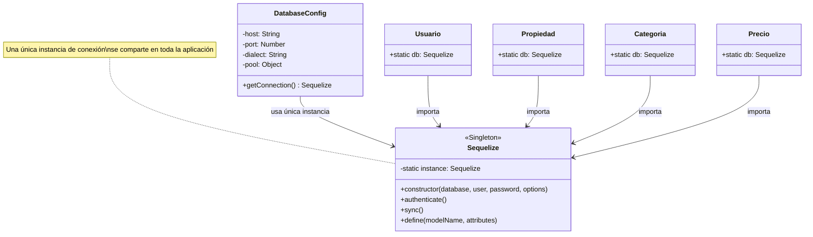

### Beneficios
- **Única conexión**: Todos los modelos comparten la misma instancia de Sequelize
- **Pool de conexiones**: Optimiza el uso de recursos con un pool configurado (max: 5, min: 0)
- **Configuración centralizada**: Todos los parámetros de conexión en un solo lugar
- **Reutilización**: Se importa en todos los modelos sin crear nuevas instancias

### Diagrama de Flujo

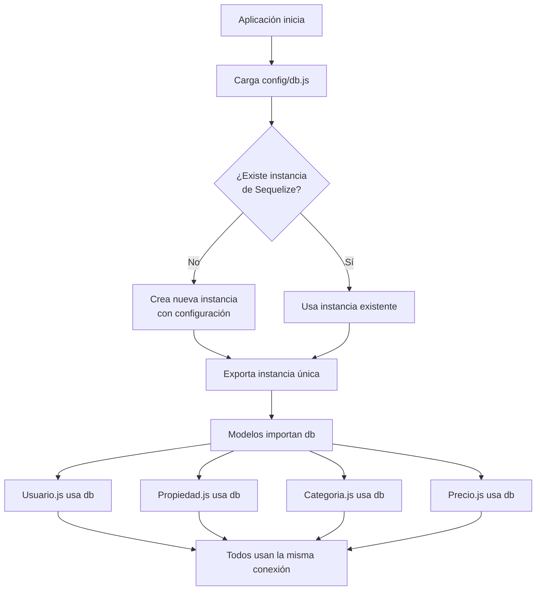

---

## 2. Patrón MVC (Model-View-Controller)

### Descripción
El patrón **MVC** separa la aplicación en tres componentes principales:
- **Model (Modelo)**: Gestión de datos y lógica de negocio
- **View (Vista)**: Presentación e interfaz de usuario
- **Controller (Controlador)**: Intermediario que maneja la lógica de aplicación

### Arquitectura del Proyecto

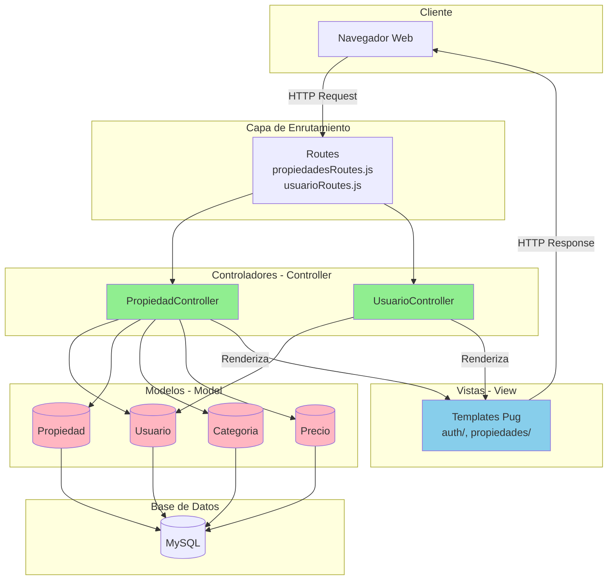

### Componentes Detallados

#### Modelos (Model)
Ubicación: `models/`

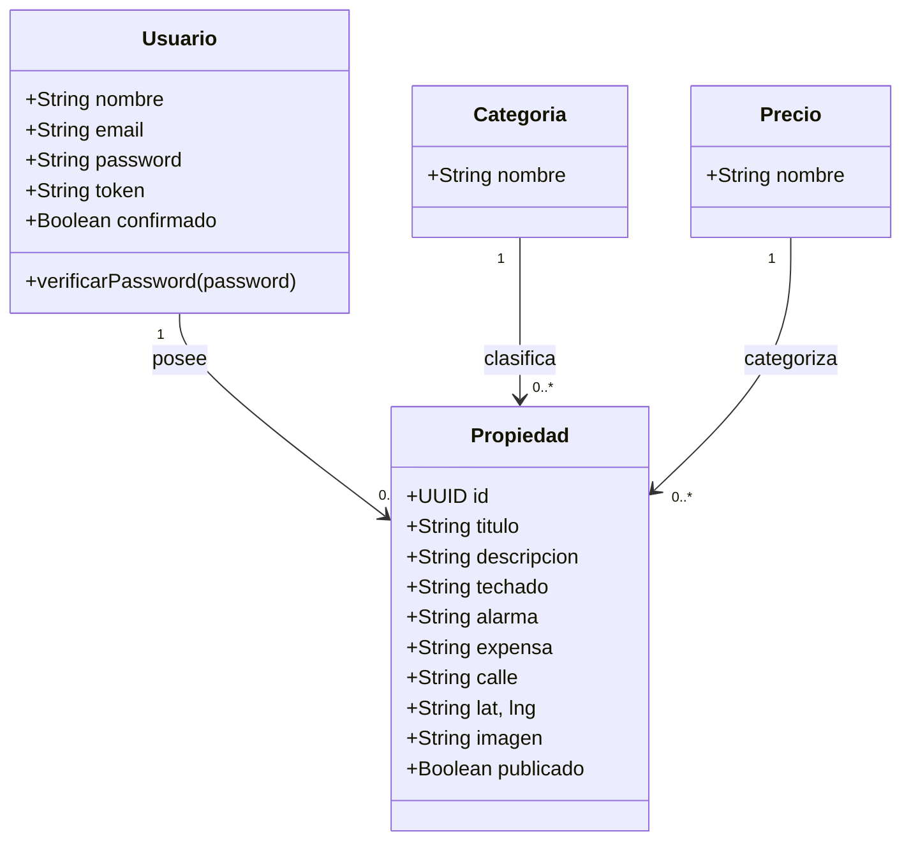

#### Vistas (View)
Ubicación: `views/`

```
views/
├── auth/
│   ├── login.pug
│   ├── registro.pug
│   └── olvide-password.pug
├── propiedades/
│   ├── admin.pug
│   ├── crear.pug
│   ├── editar.pug
│   └── agregar-imagen.pug
├── layout/
│   └── index.pug
└── templates/
```

#### Controladores (Controller)
Ubicación: `controllers/`

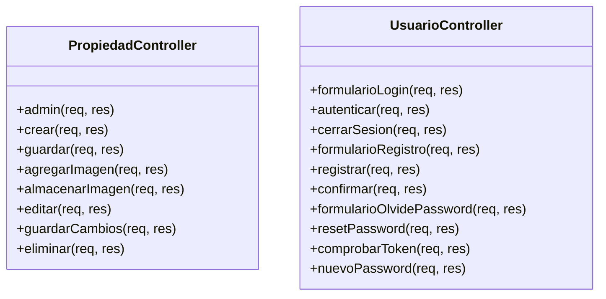

### Flujo de Datos MVC

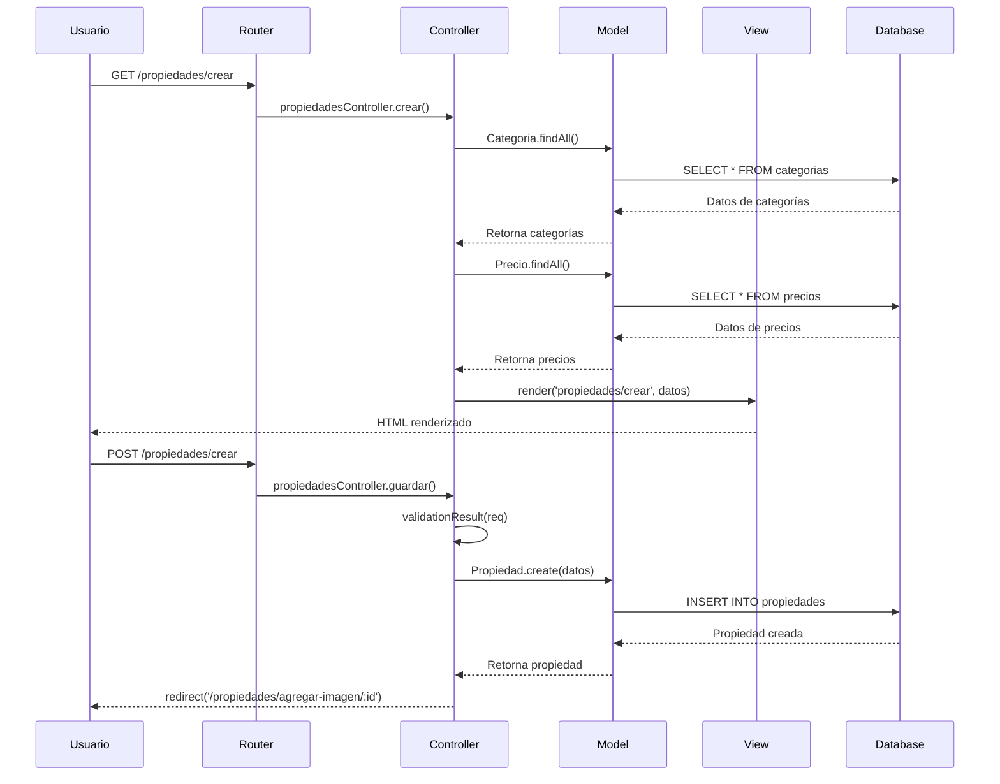

---

## 3. Patrón Observer - Event Emitter

### Descripción
El patrón **Observer** define una dependencia uno-a-muchos entre objetos, de modo que cuando un objeto cambia de estado, todos sus dependientes son notificados automáticamente.

### Implementación
Archivo: `helpers/eventEmitter.js`

```javascript
import { EventEmitter } from 'events';
import fs from 'fs';

// Sujeto del patrón Observer
const emitter = new EventEmitter();

// Observador: escribe logs cuando ocurren eventos
function writeLog(eventName, payload) {
  const timestamp = new Date().toISOString();
  const logEntry = `${timestamp} [${eventName}] ${JSON.stringify(payload)}\n`;
  fs.appendFileSync(logFilePath, logEntry);
}

// Suscripción de observadores
emitter.on('propertyCreated', function(propiedad) {
  writeLog('propertyCreated', {
    id: propiedad.id,
    titulo: propiedad.titulo
  });
});

emitter.on('propertyDeleted', function(propiedad) {
  writeLog('propertyDeleted', {
    id: propiedad.id,
    titulo: propiedad.titulo
  });
});

emitter.on('userLoggedIn', function(usuario) {
  writeLog('userLoggedIn', {
    email: usuario.email,
    nombre: usuario.nombre
  });
});

export default emitter;
```

### Diagrama de Clases

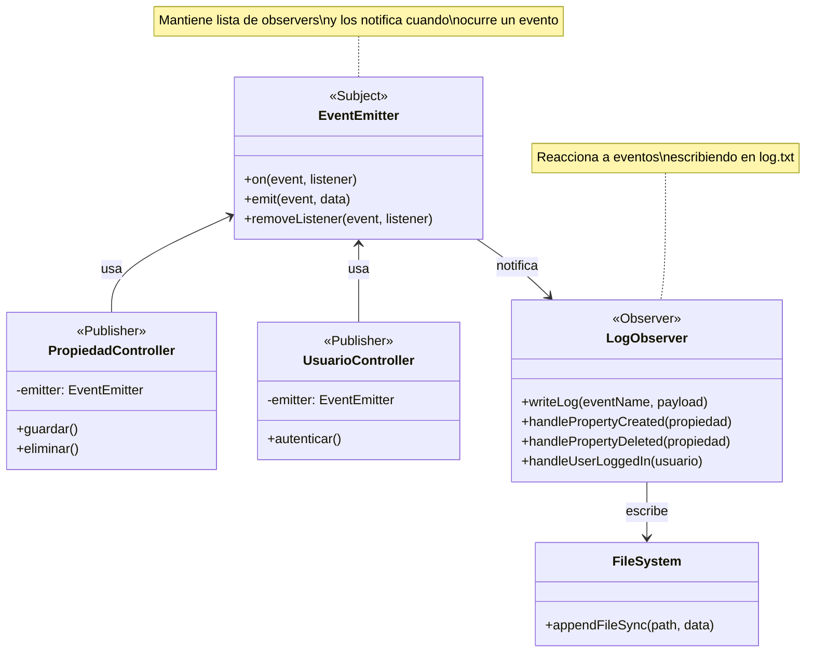

### Diagrama de Secuencia

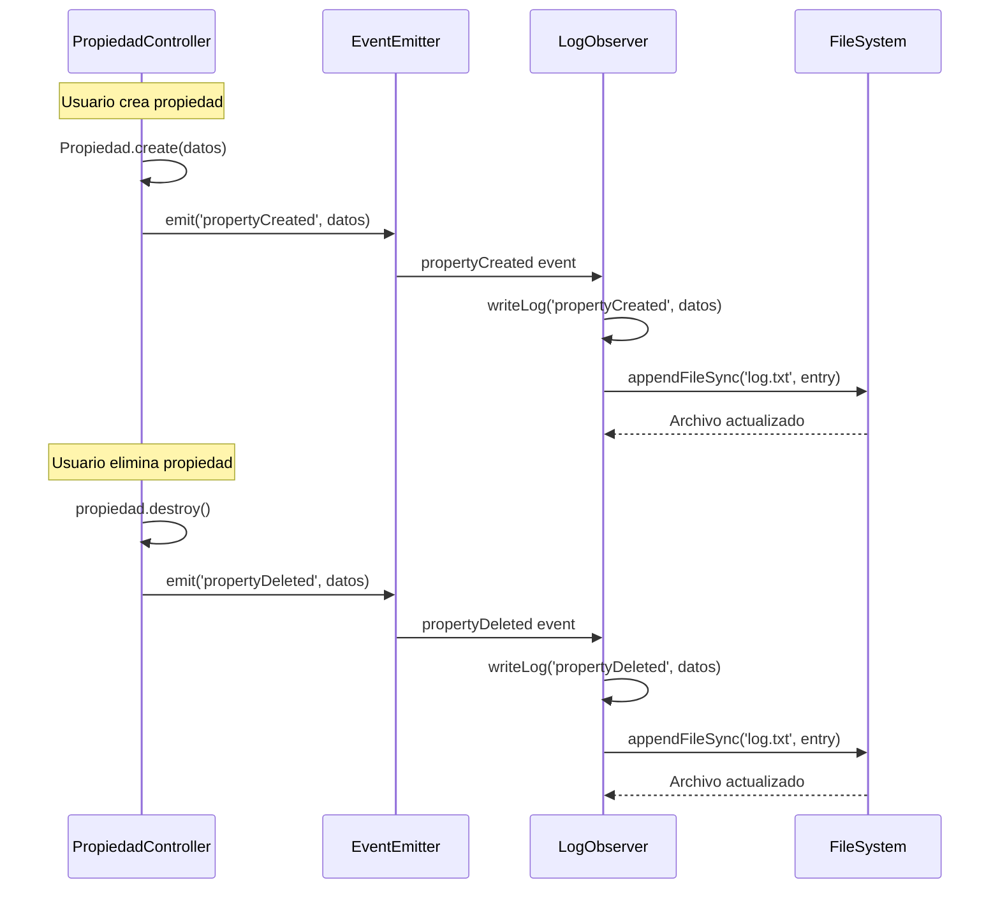

### Uso en Controladores

**Emisión de eventos** (propiedadesController.js:96-99)
```javascript
// Al crear una propiedad
emitter.emit('propertyCreated', {
    id: id,
    titulo: titulo
});

// Al eliminar una propiedad (línea 290-293)
emitter.emit('propertyDeleted', {
    id: propiedad.id,
    titulo: propiedad.titulo
});
```

### Beneficios
- **Desacoplamiento**: Los controladores no necesitan conocer la lógica de logging
- **Escalabilidad**: Fácil agregar nuevos observadores sin modificar publicadores
- **Mantenibilidad**: Lógica de logging centralizada en un solo lugar
- **Flexibilidad**: Se pueden agregar/quitar observers en tiempo de ejecución

---

## 4. Patrón Cadena de Responsabilidad - Middleware

### Descripción
El patrón **Cadena de Responsabilidad** permite pasar solicitudes a lo largo de una cadena de manejadores. Cada manejador decide si procesa la solicitud o la pasa al siguiente.

### Implementación en Express
Los middlewares en Express implementan este patrón. Cada middleware puede:
1. Procesar la petición
2. Modificar req/res
3. Finalizar el ciclo (enviar respuesta)
4. Pasar al siguiente con `next()`

### Middlewares del Proyecto

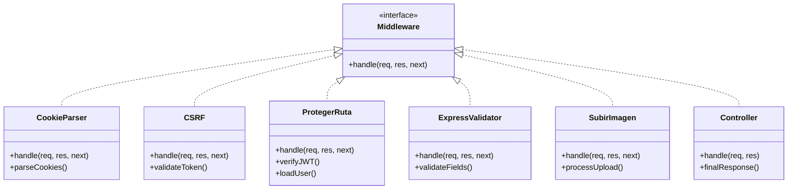

### Cadena de Middlewares en Ruta Protegida

Archivo: `routes/propiedadesRoutes.js`

```javascript
router.post('/propiedades/crear',
    protegerRuta,                    // 1. Verifica autenticación
    body('titulo').notEmpty(),       // 2. Valida título
    body('descripcion').notEmpty(),  // 3. Valida descripción
    body('categoria').isNumeric(),   // 4. Valida categoría
    body('precio').isNumeric(),      // 5. Valida precio
    guardar)                         // 6. Controlador final
```

### Diagrama de Flujo

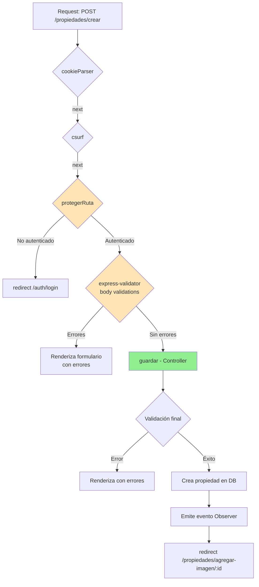

### Middleware: protegerRuta

Archivo: `middleware/protegerRuta.js`

```javascript
const protegerRuta = async (req, res, next) => {
    // 1. Verificar existencia de token
    const { _token } = req.cookies
    if(!_token){
        return res.redirect('/auth/login')  // Termina cadena
    }

    try {
        // 2. Verificar validez del token
        const decoded = jwt.verify(_token, process.env.JWT_SECRET)

        // 3. Cargar usuario desde BD
        const usuario = await Usuario.scope('eliminarPassword').findByPk(decoded.id)

        if(usuario) {
            // 4. Adjuntar usuario al request
            req.usuario = usuario
        } else {
            return res.redirect('/auth/login')  // Termina cadena
        }

        // 5. Pasar al siguiente middleware
        return next();

    } catch (error) {
        return res.clearCookie('_token').redirect('/auth/login')
    }
}
```

### Middleware: SubirImagen

Archivo: `middleware/subirimagen.js`

```javascript
import multer from 'multer'

const storage = multer.diskStorage({
    destination: function(req, file, cb) {
        cb(null, './public/uploads/')
    },
    filename: function(req, file, cb) {
        cb(null, Date.now() + '-' + file.originalname)
    }
})

const upload = multer({ storage })

export default upload
```

### Diagrama de Secuencia Completo

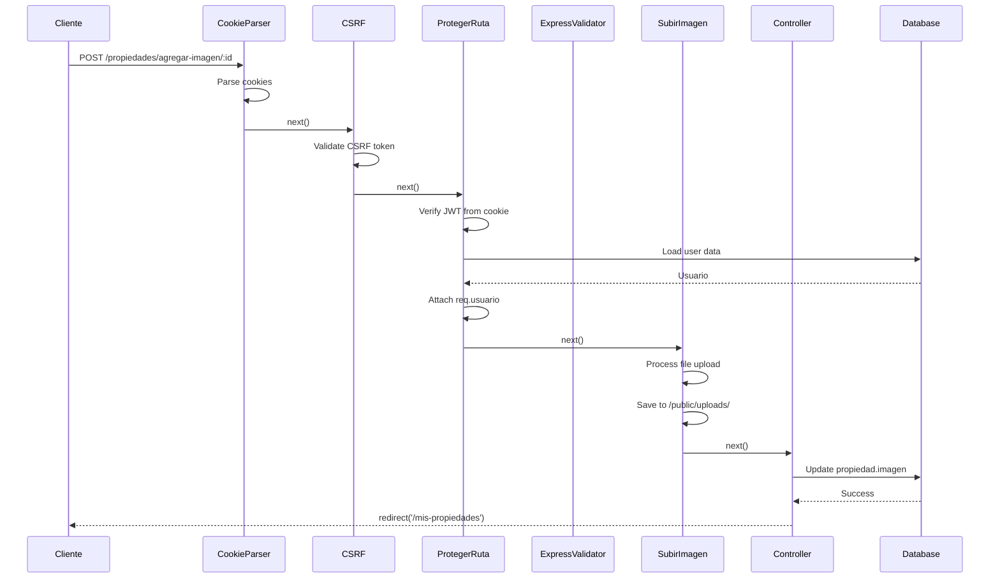

### Beneficios del Patrón

- **Separación de responsabilidades**: Cada middleware tiene una única función
- **Reutilización**: Middlewares como `protegerRuta` se usan en múltiples rutas
- **Orden flexible**: Se pueden reorganizar según necesidades
- **Fácil testing**: Cada middleware se puede probar de forma aislada
- **Extensibilidad**: Agregar nuevo middleware sin modificar existentes

### Ejemplo de Cadena Completa

```javascript
// Ruta con cadena de 6 middlewares
router.post('/propiedades/agregar-imagen/:id',
    protegerRuta,              // 1. Autenticación
    upload.single('imagen'),   // 2. Subida de archivo
    almacenarImagen           // 3. Controlador final
)
```

---

## Resumen de Patrones

| Patrón | Ubicación | Propósito | Beneficio Principal |
|--------|-----------|-----------|---------------------|
| **Singleton** | `config/db.js` | Única instancia de BD | Optimización de recursos |
| **MVC** | `models/`, `views/`, `controllers/` | Separación de capas | Mantenibilidad |
| **Observer** | `helpers/eventEmitter.js` | Sistema de eventos | Desacoplamiento |
| **Cadena de Responsabilidad** | `middleware/` | Pipeline de request | Modularidad |

---

## Interacción entre Patrones

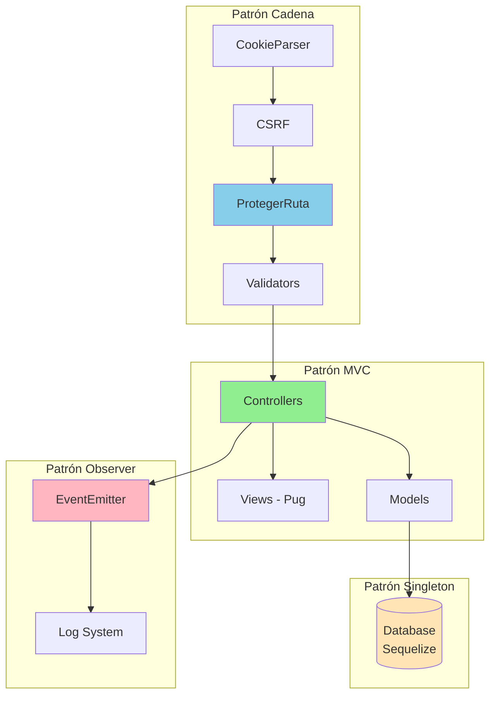

Este diseño arquitectónico permite:
- **Escalabilidad**: Fácil agregar nuevas funcionalidades
- **Mantenibilidad**: Código organizado y separado
- **Testabilidad**: Componentes independientes
- **Reutilización**: Patrones aplicables en múltiples contextos
